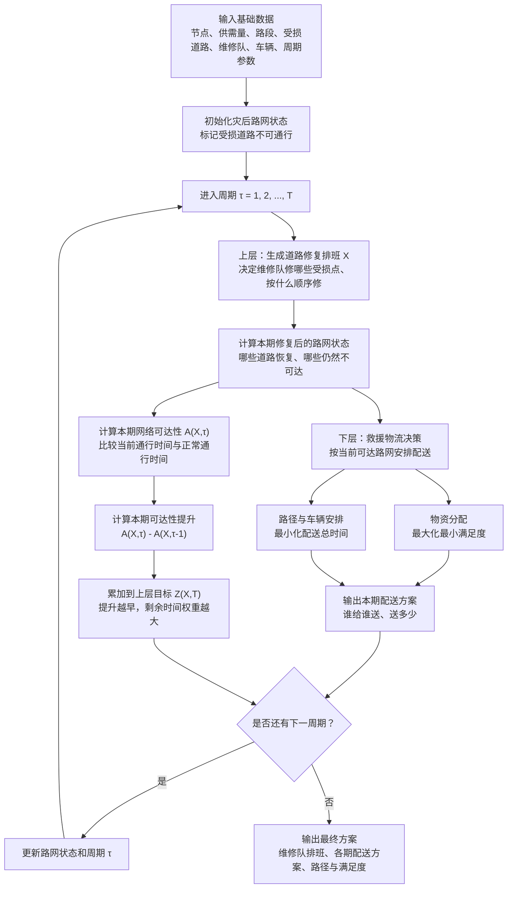

# 汶川案例模型与算法流程说明

> 基于论文 `s10479-018-3037-2.pdf` 中的 MP-NRWSRLP 模型整理。本文重点说明：数据如何进入模型、模型先做什么后做什么、目标函数如何起作用，以及配送方案如何随修路结果更新。

## 1. 核心思想

论文研究的是灾后道路修复和救援物流的联动优化问题。它不是先把所有道路修好再配送，也不是只做物资配送，而是采用“多周期 + 双层决策”的结构：

- 上层：安排维修队修哪些受损道路、按什么顺序修，目标是尽快提高道路网络可达性。
- 下层：在当前已经可用的路网上，安排物资从哪个供给点送到哪个需求点、送多少、走哪条路，目标是公平满足需求并减少配送时间。

换句话说，模型做的是：

```text
边修路，边配送；每一期根据最新路网状态重新计算。
```

## 2. 数据如何进入模型

| 数据 | 对应模型作用 |
|---|---|
| 供给节点、需求节点 | 定义哪些地方有物资、哪些地方需要物资 |
| 供给量 `S`、需求量 `D` | 用于下层物资分配和满足度计算 |
| 路段连接关系、基础通行时间 | 构建道路网络，计算最短路径和可达性 |
| 道路容量 `ca` | 用于估计拥堵影响下的实际通行时间 |
| 受损道路/受损节点 | 定义哪些路需要维修 |
| 修复时间 `sd` | 决定每个受损点需要维修队工作多久 |
| 维修队工作站和维修能力 | 约束维修队从哪里出发、能修多快 |
| 车辆容量、车辆数量 | 约束救援物资运输能力 |
| 规划期 `T` 和周期长度 `η` | 定义多周期滚动优化，例如 72 小时、每 8 小时更新一次 |

当前简化复现版本可以暂不纳入普通交通 OD 需求 `Qrs`，先聚焦“道路修复 + 救援物流”主线。

## 3. 模型结构

论文模型是多周期双层规划：

```text
上层：道路修复排班
下层：救援物资分配与运输路径
```

### 上层：道路修复排班

上层由应急指挥中心决策，决定：

- 每支维修队负责哪些受损道路
- 每支维修队按什么顺序访问受损点
- 每个周期结束后哪些道路恢复通行

上层目标是最大化累计可达性：

```text
max Z(X, T)
```

其中：

- `X` 是道路修复排班策略。
- `T` 是总规划周期数。
- `Z(X,T)` 表示整个规划期内道路网络恢复得有多早、多快。

论文中累计可达性的核心形式可以理解为：

```text
Z(X,T) = Σ [A(X,τ) - A(X,τ-1)] × (T - τ) × η
```

含义是：

- `A(X,τ)`：第 `τ` 期的网络可达性。
- `A(X,τ) - A(X,τ-1)`：这一期新增的可达性提升。
- `(T - τ) × η`：这一期提升还能持续影响后面多少时间。

因此，同样一条关键道路，越早修通，对目标函数贡献越大。

### 下层：救援物流分配与运输

下层在上层给定的当前路网状态下决策，决定：

- 每个需求点从哪个供给点获得物资
- 每个需求点获得多少物资
- 用哪些车辆运输
- 走哪条可用路径

下层有两个核心目标。

第一个目标是最大化最小满足度：

```text
max min(已分配物资 / 需求量)
```

它追求公平性，避免某些需求点获得很多物资，而另一些需求点几乎没有物资。

第二个目标是最小化配送总时间：

```text
min 总配送时间
```

它追求效率，在可达路径、车辆能力和供给能力约束下尽量缩短运输时间。

## 4. 多周期运行逻辑

模型不是一次性给出静态方案，而是在多个周期内滚动更新。

以汶川案例为例：

- 总规划期：72 小时。
- 周期长度：`η = 8` 小时。
- 周期数：`T = 9`。

每个周期的逻辑是：

1. 根据当前道路状态，评估哪些供给点和需求点可达。
2. 上层生成或更新维修队排班，决定本期修哪些受损道路。
3. 本期内已经可达的需求点可以安排配送。
4. 周期结束后，完成维修的道路恢复通行。
5. 更新路网状态，进入下一周期。

因此，配送不是等所有道路修完才开始，而是从第 1 期就开始。只是某个需求点是否能收到物资，取决于当期从供给点到该需求点是否已经可达。

## 5. 流程图



## 6. 一个小例子

以节点 1 到节点 8 为例：

- 节点 1：都江堰，供给点，供给量 `S = 3000` 吨。
- 节点 8：Anlong，需求点，需求量 `D = 382` 吨。
- 如果道路都通，路径可以是 `1 -> 4 -> 5 -> 6 -> 7 -> 8`。

表 15 显示：

```text
τ = 1：1 -> 8 不可达
τ = 2：1 -> 8 不可达
τ = 3：1 -> 4 -> 5 -> 6 -> 7 -> 8 可达
```

这说明在前两期，模型不能给节点 8 安排这条配送路径；到了第 3 期，相关道路修复后，配送路径才可用。

表 14 中节点 8 的分配结果是：

```text
节点 8 需求量：382
从供给点 1 获得：305
满足度：305 / 382 ≈ 79.84%
```

这体现了下层目标：在可达路网上尽量公平地分配物资，同时选择可行路径完成配送。

## 7. 简化复现时的推荐口径

为了先跑通核心模型，可以采用以下简化：

| 模块 | 推荐处理 |
|---|---|
| 普通交通 OD `Qrs` | 暂不纳入 |
| 普通交通流 `fa` | 暂不单独建模 |
| 路段容量 `ca` | 使用当前文档中的估算容量 |
| 需求量 `D` | 直接使用表 1 的需求量 |
| 房屋倒塌比例 | 暂不反推，视为需求量估算的上游依据 |
| 受损道路长度 | 暂不反推，直接使用表 2 的修复时间 `sd` |

这样可以先得到一个可解释、可运行的核心版本：

```text
道路修复排班 -> 路网状态更新 -> 救援物资分配 -> 配送路径计算
```

后续如果要更贴近论文完整模型，再补普通交通 OD、交通流分配和更真实的道路容量数据。

