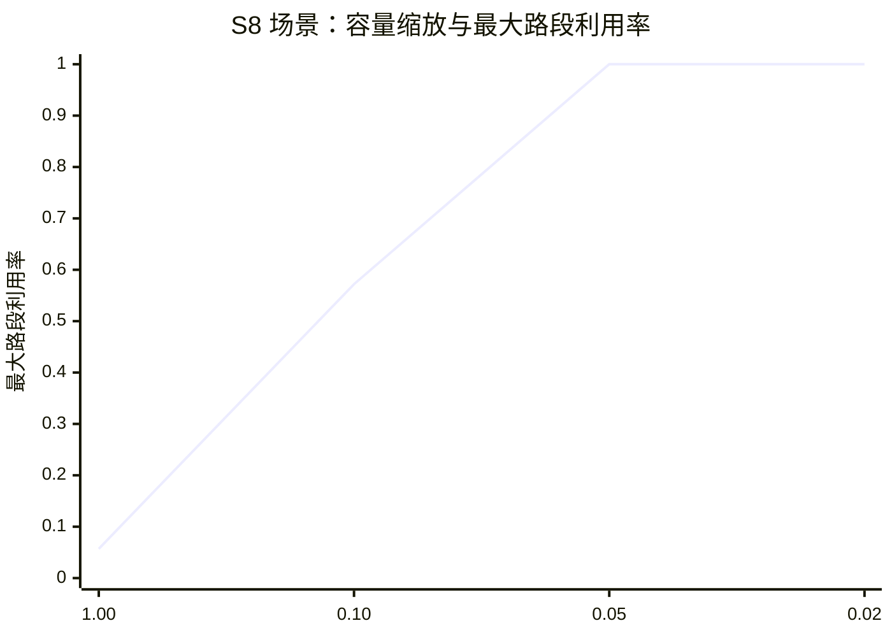
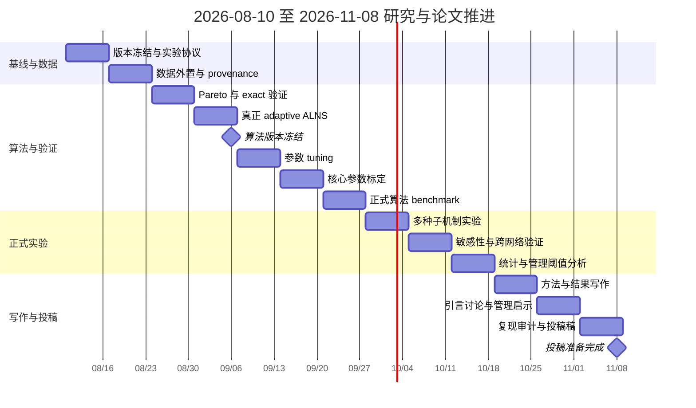

> 历史归档（2026-09-07）：保留研究演变记录；其中计划、数值和完成状态不代表当前实现。当前口径见 [研究说明](../research.md) 和 [实验进展](../experiments.md)。

# VRP Research 仓库研究成果审阅、工程管理发表路线与三个月推进计划

## 执行摘要

仓库已形成“汶川案例—容量渐进恢复—异质车辆—维修效率逐期揭示—滚动决策”的完整研究原型，并具备 NSGA-II、动态机制实验和测试框架；但仍属机制验证阶段：核心参数未标定、ALNS 实现尚非真正自适应、完整 Pareto 与正式统计结果缺失。最可行路线是转向“灾后恢复资源配置与信息价值”的工程管理论文，优先补数据标定、正式对照、多种子统计和可解释管理结论。fileciteturn22file0L2-L2 fileciteturn5file0L2-L2

## 目录与审阅范围

**审阅基准：2026 年 8 月 8 日。** 本次研究以 GitHub 仓库当前 `main` 内容为主要证据，重点静态审阅了研究文档、模型代码、实验代码、测试、数据说明及参考文献目录，并用出版社/期刊官方网站核对研究前沿和工程管理投稿定位。由于本次环境不能直接克隆并执行仓库，因此下文凡涉及“测试通过”或历史实验结果，均明确区分“仓库记录”“代码可见事实”和“本次重新计算”；**本次没有自行重新跑全套实验**。

| 报告部分 | 核心问题 |
|---|---|
| 仓库审阅 | 现在到底有哪些可用研究资产，哪些只是 proposal、历史记录或内部草稿 |
| 研究成果 | 已经建立了什么模型、算法、实验机制，哪些结果仍然有效 |
| 不足与风险 | 哪些问题会直接导致审稿拒稿或结论不可信 |
| 发表路线 | 怎样从“运筹算法原型”转化为“工程管理研究问题” |
| 技术改进 | 算法、指标、统计、数据、复现、可视化具体改什么 |
| 三个月计划 | 从现在到 2026 年 11 月上旬逐周完成什么、交付什么 |

仓库的主体结构已经较完整：`docs/` 保存模型、算法、实验记录和文献综述；`scripts/reproduce/` 是复现与实验主线；`tests/` 有机制级回归测试；`references/` 当前跟踪两份 PDF；`pyproject.toml` 与 `uv.lock` 用于 Python 环境管理。fileciteturn25file0L2-L2 fileciteturn8file0L2-L2 fileciteturn9file0L2-L2 fileciteturn30file0L2-L2

**仓库内容审阅清单与判断如下。**

| 文件/目录 | 类型 | 主要内容与用途 | 本次关键发现 |
|---|---|---|---|
| `README.md` | 项目总览 | 当前研究主线、运行方法、实验边界 | 已明确定位为“容量渐进恢复＋异质车辆＋NSGA-II/ALNS”，并主动声明当前还是 prototype，正式论文仍缺 Pareto、消融、多种子统计和参数标定。 |
| `docs/project_inventory.md` | 资产清单 | 当前核心文件、已删除旧实验、维护规范 | 对项目整理较好；已经主动删除重复的早期展示型代码，建议继续坚持单一复现管线。 |
| `docs/HANDOFF.md` | 状态/交接记录 | 当前结果状态、过期结果、下一步 | 非常重要：仓库自己已经标明部分旧实验在新增“边—周期吞吐约束”后失效，需要重跑，因此旧数字不能直接作为论文证据。 |
| `docs/wenchuan_case_model_inputs.md` | 案例数据说明 | 38 节点、道路、需求、修复时间、车辆等 | 汶川案例是目前最重要的数据资产，但道路容量是项目自行估算而非现场观测，供给量单位/来源也存在推断。fileciteturn21file0L2-L2 |
| `docs/proposed_capacity_recovery_data.md` | 数据设计 | 恢复阶段、车型阈值、PCU、维修效率、周期路网状态 | 对未来数据结构设计已经较完整；但大量字段仍只是“建议数据表”，没有真正外置为 CSV/JSON 数据层。fileciteturn27file0L2-L2 |
| `docs/algorithm_flow.md`、`docs/genetic_algorithm.md` | 原模型复现说明 | 原论文双层结构及 GA 流程 | 是理解 Li & Teo 基线的重要桥梁。 |
| `docs/proposed_capacity_recovery_model.md` | 核心模型 proposal | 修复进度→容量→车型可通行→配送，多目标模型 | 当前最有潜力的理论资产；已经从二元道路状态推进到分阶段服务恢复，并显式引入维修效率逐期揭示。fileciteturn22file0L2-L2 |
| `docs/proposed_nsga2_alns_algorithm.md` | 算法 proposal | NSGA-II＋ALNS，破坏/修复算子、自适应权重、rolling horizon | **设计方案强于当前代码实现**：文档规划真正的 adaptive destroy-repair ALNS，但代码尚未完整落实。fileciteturn23file0L2-L2 |
| `docs/capacity_recovery_experiment_notes.md` | 实验记录 | 容量压力测试、旧 prototype 数字、当前验证边界 | 能清楚区分旧结果和加入容量后的新验证，是良好的研究记录；但不是正式统计实验。 |
| `docs/dynamic_interaction_experiment_results.md` | 机制实验记录 | binary/progressive/open-loop/rolling 对比 | 历史上已经出现较强机制差异，但文档明确提醒其中多数数字在新机制后已经 stale。fileciteturn6file0L2-L2 |
| `docs/dynamic_interaction_experiment_report_detailed.md` | 详细实验报告 | 动态交互的解释与案例分析 | 可直接转化为论文 Results/Discussion 框架，但数值表必须以新版本重跑结果替换。 |
| `docs/emergency_relief_vrp_literature_review.md`、`literature_review_and_innovation_points.md` | 文献综述 | 国内外道路恢复、应急物流、不确定性、公平、多模式等 | 文献地图已经较成熟，而且正确认识到“修路＋配送”本身已经不是创新。fileciteturn26file0L2-L2 |
| `docs/emergency_relief_vrp_review_article.md` 等 | 综述稿件 | 独立综述文章及多轮内部 ARS review | 可作为副线文章；仓库内部评审已经达到“投稿前精修”判断，但这属于**内部/模拟审稿记录，而非外部期刊审稿**。fileciteturn28file0L2-L2 |
| `scripts/reproduce/capacity_recovery.py` | 核心算法代码 | 汶川/随机实例、容量恢复、车辆阈值、NSGA-II、局部搜索 | 当前论文模型的真正运行核心；但最终只输出一个代表解，而不是完整 Pareto 集。fileciteturn14file0L2-L2 fileciteturn17file0L2-L2 |
| `scripts/reproduce/dynamic_interaction_experiments.py` | 机制实验代码 | 四种机制、维修效率不确定性、open-loop/rolling | 当前“信息逐期揭示”论文方向的核心代码，但 rolling 使用的是逐期贪心 objective-aligned step，并不是 rolling NSGA-II+ALNS。fileciteturn18file0L2-L2 fileciteturn19file0L2-L2 |
| `scripts/reproduce/dynamic_interaction_grid.py` | 实验矩阵 | 修复资源规模×维修队数×seed 的网格实验 | 能自动输出机制配对差异，但当前没有置信区间、显著性检验或跨参数统计模型。fileciteturn29file0L2-L2 |
| `run_random_experiments.py`、`ga_solver.py` | 基线实验 | 随机网络和普通 GA | 适合作为算法基线，但当前正式论文对照体系还没有围绕新模型统一重跑。 |
| `dispatch.py`、`metrics.py`、`model.py` | 公共模块 | 配送、指标、数据结构 | `model.py` 已有较清晰 dataclass 结构，是后续重构的良好基础。fileciteturn12file0L2-L2 |
| `instance_generator.py` | 仿真数据 | 随机网络生成 | 可做规模实验，但现有记录显示一些随机场景太容易，在首期即几乎完全可达，辨别力不足。 |
| `visualize.py`、`plot_initial_network.py` | 可视化 | 网络与结果图 | 具备基本展示功能，但尚缺正式论文需要的 Pareto、置信区间、效应图和时空热力图。 |
| `tests/test_reproduce.py` | 单元/回归测试 | 复现、容量、边界、open-loop/rolling 机制等八项测试 | 测试覆盖了重要机制，但没有 exact optimum、Pareto 排序、ALNS 自适应、数据 schema、性能回归测试。fileciteturn24file0L2-L2 |
| `references/s10479-018-3037-2.pdf` | 原始参考文献 | Li & Teo 原论文 | 是基础研究起点；本次没有直接解析 PDF 图表，而是利用仓库提取文档与出版社元数据交叉核验。fileciteturn30file0L2-L2 |
| `references/无人机配送…pdf` | 参考文献 | 多模式配送综述 | 与未来无人机扩展有关，但不是当前论文最优先资产。 |
| `presentations/` | 汇报材料 | 原论文总结 PPT 与构建脚本 | 对答辩有用，对研究证据本身贡献有限。 |
| `pyproject.toml`、`uv.lock`、`.python-version` | 环境 | Python 3.12 与依赖锁定 | 环境管理较好；当前主要依赖 NetworkX、NumPy、Matplotlib、Shapely 等，但正式统计分析工具链尚未进入项目。fileciteturn10file0L2-L2 |
| 正式 `outputs/` 结果快照 | 实验数据 | 应含 CSV/JSON/图 | **未在当前仓库中提供可审计的正式论文结果集**；这会直接影响结果追溯与同行复现。 |
| 独立原始 `data/` 数据目录 | 数据 | CSV/JSON/schema | **未提供**；核心汶川数据目前大量硬编码于 Python 或 Markdown。 |
| CI 工作流、`LICENSE`、结果 manifest | 工程化复现 | 自动测试、许可、运行元数据 | **未提供/未发现**；不是模型创新问题，但会降低公开复现质量。 |

总体上，仓库并不是“只有想法没有实现”的状态。相反，它已经跨过了概念阶段，进入了**可运行原型＋机制检查＋论文素材积累**阶段；真正缺的是从“研究代码”到“可发表证据”的最后一层实验工程。

## 研究成果与证据强度

当前研究可以概括为一条相当清楚的因果链：

```mermaid
flowchart LR
    A[灾后路网与受损道路] --> B[维修队资源分配与维修投入]
    B --> C[实际维修效率 ξ 逐期实现]
    C --> D[道路修复进度 p]
    D --> E[容量恢复 g(p) 与速度恢复 s(p)]
    E --> F[不同车型通行阈值]
    F --> G[边-周期剩余 PCU 容量]
    G --> H[动态路径与车辆配送]
    H --> I[需求满足率与公平性]
    I --> J{下一周期}
    J -->|Open-loop| K[继续执行期初计划]
    J -->|Rolling| B
```

这条链条与原始 Li & Teo 模型相比，真正的新内容不是“把修路和配送结合起来”——原论文早已建立多周期双层道路修复与救援物流模型——而是把道路从“修好/没修好”扩展为**修复过程中逐步产生服务能力**，再通过车型门槛、周期吞吐和实时修复信息影响资源调度。原论文使用多周期双层模型和遗传算法，并以随机网络及汶川案例验证，因此“集成修复与配送”不能再作为你的核心创新宣称。citeturn13search2

**当前方法和模型已经形成以下成果：**

| 研究要素 | 当前成果 | 成熟度 | 发表判断 |
|---|---|---:|---|
| 道路状态 | 从二元状态扩展到 0–1 修复进度及多个容量阶段 | 高 | 是真正可写入创新点的部分 |
| 道路容量 | `C_a^t=C_a^0 g(p_a^t)`，按周期维护可用 PCU | 中高 | 机制完成，但基础容量未标定 |
| 车型异质性 | 5/10/15/20 吨车辆，修复门槛 0.30/0.50/0.70/0.80 | 中 | 模型清楚，参数仍是场景值 |
| 速度恢复 | 与容量恢复分开建模 | 中 | 概念正确，但当前默认值仍相同 |
| 维修不确定性 | `ξ_a^t` 逐期实现并在下一期可观测 | 中高 | 信息价值方向的关键基础 |
| 配送 | 车型相关动态路网、容量过滤、残余容量下重新寻路 | 中高 | 已明显强于单纯可达性模型 |
| 公平性 | 最大最小满足率 | 中 | 能用，但工程管理论文需要丰富社会公平内涵 |
| 多目标 | 累计未满足、时间成本、最低满足率 | 中高 | 目标体系合理 |
| NSGA-II | 非支配排序、拥挤距离、交叉变异已实现 | 中高 | 框架真实存在，不是伪代码 |
| ALNS | 当前是若干局部操作随机选择 | **中低** | 尚不能严格称“完整 adaptive ALNS” |
| Rolling | 根据已实现修复状态逐期重新决策 | 中高（机制） | 很适合工程管理“信息价值”论文 |
| Rolling 优化器 | 当前为即时收益贪心选择 | 中低 | 不能宣称 rolling NSGA-II+ALNS 性能 |
| 多种子实验框架 | 已有 seed 和共同随机数 | 中高 | 实验设计基础很好 |
| 正式统计 | **未提供** | 低 | 发表前必须补 |
| 完整 Pareto | **未提供** | 低 | 多目标算法论文的硬缺口 |

上述算法状态可直接从实现核实：NSGA-II 的排序、拥挤距离和父子代选择已经存在；但最终 `solve_capacity_instance()` 从第一 Pareto front 中按一个代表性 key 选择单一方案，并只写 `runs.csv/solutions.json/convergence.csv`，因此没有真正保存和分析整个非支配解集。fileciteturn16file0L2-L2 fileciteturn17file0L2-L2

更重要的是，proposal 中描述的 ALNS 包含 destroy/repair operator pool、历史绩效、自适应权重更新等结构，而当前 `_alns_improve()` 只是从五类局部操作中随机选一个，利用固定标量 `F1 + 0.001F2 + F3` 做接受判断，并带少量随机接受；因此当前代码更准确的名称是**NSGA-II＋随机化大邻域/局部强化原型**。真正的 ALNS 原始定义强调多个竞争子启发式按照历史绩效调整使用频率，这也是当前设计文档与代码的明显落差。fileciteturn23file0L2-L2 fileciteturn17file0L2-L2 citeturn9search0

**案例与实验设置。**

汶川当前实例包含 38 个节点、51 条无向路段、16 条受损道路；节点中 3 个供给/维修工作站、35 个需求点，供给总量 9,000、需求总量 11,288，因此在供给完全使用且不损失的理想情况下，总需求满足率理论上限约为 **0.7973**。规划期 72 小时，以 8 小时为周期，共 9 期。fileciteturn21file0L2-L2 fileciteturn24file0L2-L2

这里存在一个特别值得保留的研究设计：维修效率随机实现采用共同随机数，同一 seed 下各机制面对相同 `ξ_a^t`，能够把机制差异与随机场景差异分离，这为未来做配对统计非常有价值。fileciteturn19file0L2-L2

**当前可以信赖的定量证据与不能再作为最终证据的数字，需要严格分开：**

| 结果 | 数值 | 证据状态 | 可否直接写入正式论文 |
|---|---:|---|---|
| 汶川节点/边/受损边 | 38 / 51 / 16 | 当前代码与测试一致 | 可以 |
| 供给/需求 | 9,000 / 11,288 | 当前代码与测试一致 | 可以 |
| 理论满足率上限 | 0.7973069 | 当前代码测试 | 可以 |
| `capacity_scale=1.00`，S8 最大边利用率 | 0.057 | 加入吞吐机制后的检查 | 可作为机制校验，不宜当主实验 |
| `capacity_scale=0.10` | 0.572 | 同上 | 同上 |
| `capacity_scale=0.05` | 1.000，部分边容量约束活跃 | 同上 | 同上 |
| `capacity_scale=0.02` | 1.000，blocked≈2,076.62 吨 | 同上 | 同上 |
| `capacity_scale=.02` 全 12 资源配置×4机制 | 48/48 出现容量阻塞 | 当前压力测试 | 可说明压力场景有效 |
| 当前不确定性 smoke test | 5 seeds 中 rolling 对 open-loop 3 次改善、2 次持平，CUA 平均配对差约 0.05297 | 当前小规模机制检查 | **不足以作为论文结论** |
| 历史 progressive static 对 binary 平均改善 | ≈5.51% | 吞吐机制更新前的旧结果 | **不可作为当前正式结论** |
| 历史 rolling 对 binary 平均改善 | ≈15.15% | 同上 | **不可作为当前正式结论** |
| 正式多算法 Pareto HV/IGD+ | **未提供** | 缺失 | 直接影响算法论文发表 |
| 置信区间/显著性/效应量 | **未提供** | 缺失 | 直接影响实证可信度 |

仓库自己的实验记录已经明确标记：旧动态报告是在新增边—周期容量及维修效率逐期揭示机制之前得到的，因此旧结果应当视为“历史机制开发记录”，不能包装成最新模型的正式实验结果。fileciteturn5file0L2-L2 fileciteturn6file0L2-L2

当前容量压力测试至少说明一件有用的事：**你的容量机制不是“加了约束但实际上永远不起作用”**。在 S8 场景中，容量缩放从 1.00 降到 0.05 后瓶颈边开始饱和；进一步到 0.02 后出现大量无法在当期消化的运输量。这个非线性变化很适合未来转化成“工程资源的临界阈值”而不仅是算法性能指标。fileciteturn7file0L2-L2



但目前不能从这四个点声称“临界容量就是 0.05”；准确的管理阈值必须通过更细的参数扫描、多个随机 realization 和置信区间估计。

**结果图表方面，现有数据只能支撑机制级示意，尚不足以制作正式算法性能图。正式论文至少应产生以下图表：**

| 正式图表 | 横/纵轴或内容 | 当前状态 |
|---|---|---|
| Pareto 前沿图 | F1 累计未满足需求—F2 时间，颜色表示 F3 公平性 | **未提供完整 Pareto 数据** |
| HV/IGD+ 箱线或 ECDF | NSGA-II、NSGA-II+ALNS、基线算法 | **未提供** |
| 服务恢复曲线 | 时间/周期—总满足率、最低满足率 | 可生成，但需重跑最新实验 |
| 信息价值图 | 不确定性×容量紧张程度—rolling 相对 open-loop 改善 | 当前只有 smoke test |
| 资源响应面 | 维修队数×维修效率×容量—CUA/恢复时间 | grid 框架已具备 |
| 路网容量热力图 | 路段×周期—利用率或剩余容量 | 代码已有原始指标，尚未系统可视化 |
| 配对效应森林图 | 每一资源场景的 rolling-open-loop 差异及 95% CI | **统计层尚未实现** |
| 管理 Pareto 方案表 | “低成本/均衡/公平优先”三个代表方案 | **未提供** |

这正是当前“有研究成果但还没有论文证据闭环”的核心判断。

## 不足、风险与发表门槛

从 2026 年的文献位置看，竞争已经相当激烈。2021 年 OR Spectrum 已研究异质道路中断下的道路恢复与救援配送协调；2021 年 Transportation Research Part B 已研究修复时间现场逐步获知的在线道路恢复；2023 年 Omega 更进一步，把在线损毁评估、道路恢复与救援配送整合；2024 年 Computers & Industrial Engineering 已有异质维修队、不同损坏类型和鲁棒不确定性的修复—配送模型；2026 年又出现了不确定修复时间下的 robust multicrew scheduling/routing。citeturn6search8turn6search13turn6search11turn6search9turn6search2

所以论文不能把以下内容单独写成“主要创新”：**道路修复＋配送、多周期、不确定性、异质维修队、在线更新、NSGA-II 或 ALNS本身**。真正有机会形成差异化的组合，是：

> **“部分修复即产生服务能力”＋“不同车辆对应不同可用门槛”＋“修复进度信息逐期揭示”＋“何时值得重规划/增加维修资源/投入监测”的工程管理决策规律。**

风险排序如下。这里的“严重性”表示对论文可信度的损害，“优先级”表示建议修复顺序。

| 风险/不足 | 严重性 | 优先级 | 为什么会影响发表 | 建议 |
|---|---|---|---|---|
| 最新机制修改后正式全实验尚未重跑 | **高** | **P0** | 当前很多最好看的数字已经过期 | 冻结版本后从零重跑全部正式结果 |
| ALNS 设计与实现不一致 | **高** | **P0** | 论文若声称“adaptive ALNS”，审稿人检查算法会发现没有自适应算子权重 | 实现真正 destroy/repair pool＋adaptive weight＋接受准则 |
| 只保存代表解，不保存完整 Pareto | **高** | **P0** | 无法证明多目标算法的收敛性和多样性 | 输出所有 rank-0 解并计算 HV、IGD+ 等 |
| 没有算法 benchmark 和 exact 小实例 | **高** | **P0** | 不知道算法到底好多少，也不知道 decoder 是否产生系统误差 | 小实例 MIP/CP 最优解＋GA/NSGA-II/NSGA-II-LNS/ALNS 消融 |
| 正式多种子统计缺失 | **高** | **P0** | 随机算法单次或少量 seed 的改善不能成为稳健证据 | 20–30 次独立算法运行；机制实验建议至少 30 个共同随机 seed |
| 道路容量为规则估计 | **高** | **P0/P1** | “容量渐进恢复”恰好是你的核心创新，因此容量数据不可信会打击核心贡献 | 取得道路等级/车道数/设计能力或至少建立有依据的标定区间 |
| `pcu_per_vehicle=1/1.5/2/2.5` 为场景值 | **高** | **P0/P1** | 同样直接决定容量机制效果 | 交通工程依据＋宽范围敏感性 |
| 车型通行门槛 0.30/0.50/0.70/0.80 未标定 | **高** | **P1** | “异质车型提前进入”的结果可能由人为阈值驱动 | 专家/规范场景＋连续敏感性 |
| `ξ~U(1-δ,1+δ)` 为独立均匀场景 | **高**（信息价值论文） | **P1** | rolling 优势高度依赖不确定性结构 | 至少增加相关性、偏态、系统性低效率和 misspecification 场景 |
| 维修队转场、准备、设备移动时间被吸收进修复工时 | 中高 | P1 | 对真实工程项目排程可能过于乐观 | 加 crew travel/setup，或把论文明确限定为战术级派工 |
| 每辆车每周期最多一趟、无跨期 turnaround | 中高 | P1 | 8 小时周期很长，车辆可重复执行的实际能力没有显式描述 | 引入 round-trip/loading/turnaround 时间预算 |
| 没有普通社会交通/背景 OD | 中 | P2 | 不能声称模拟“拥堵”；目前只是救援车辆吞吐 | 保持现有措辞；取得数据后再做 BPR |
| 单一真实案例来自 2008 汶川 | **高**（外部效度） | P1 | 一个旧案例无法证明广泛适用性 | Wenchuan benchmark＋多个仿真网络＋至少一个第二现实/公开网络 |
| 随机网络部分场景太容易 | 中高 | P1 | 难以区分算法与机制 | 控制连通性、瓶颈度、damage criticality 生成挑战实例 |
| 数据硬编码在 `capacity_recovery.py` | 中高 | P1 | 数据谱系不透明，修改代码即可改变“数据” | 拆成 `data/*.csv`＋schema＋source/provenance |
| 结果目录未作为正式快照保存 | 中高 | P0/P1 | 无法把论文表格追溯到具体 commit/seed/config | 每次正式实验写 manifest、git SHA、hardware、seed、runtime |
| 没有 CI | 中 | P2 | 后续改算法容易静默破坏机制 | GitHub Actions 执行单元测试＋small smoke |
| 公平性目前仅最低满足率 | 中高 | P1 | 工程管理的“公平/公共价值”故事较弱 | 加 vulnerability-weighted service、Gini/Atkinson、关键设施服务 |
| 工程管理理论和管理变量不足 | **高** | **P0** | 当前论文仍容易被评价为“一个 VRP/启发式算法变体” | 从算法性能转向资源配置、信息价值、韧性恢复和决策阈值 |
| 综述稿是叙述性而非系统综述 | 中 | P2 | 若独立投综述，严刊可能要求更透明的方法 | 若投稿，补检索数据库、检索式、时间范围和纳排准则 |

其中，最重要的算法问题不是“NSGA-II 写得不好”，而是**论文主张和实现必须一致**。NSGA-II 原论文关注非支配解集的收敛与分布，完整 Pareto 前沿正是它存在的意义；而当前只取一个代表解会损失这部分证据。citeturn9search1

第二个最重要的问题是**数据 validity 与创新点高度重合**。仓库明确说明汶川案例的道路基础容量并非原论文逐边给出的实测数据，而是根据路段通行时间和场景规则补充的 400–1200 pcu/h 估计；单车 PCU、通行进度阈值和维修效率分布同样是原型场景参数。fileciteturn21file0L2-L2 fileciteturn27file0L2-L2

这意味着：**模型机制可以现在投稿前推进，定量政策结论却不能在这些参数未标定时写得过实。** 合理写法应是“scenario-based policy insights”或“mechanism-based findings”，等参数有证据后再升级为现实政策建议。

工程管理定位则是另一个决定性问题。Journal of Management in Engineering 近年的灾后恢复工作明显强调公共机构如何在有限资源、社会经济因素和社区服务需求下制定恢复优先级；2025 年的研究进一步将社区人口属性、公共设施、居民需求和基础设施恢复结合起来。citeturn5search1turn5search0turn5search2turn5search5 当前 ENGINEERING Management 的 scope 也明确包含交通工程系统管理、物流与供应链、系统工程，并已刊出多维修队基础设施恢复优化研究。citeturn11search0turn7search3

因此，**你目前最大的“方向风险”不是算法不够复杂，而是管理含义还没有压过算法细节。**

## 工程管理论文路线

我建议采用“**一条主线、两条后续线、一条快速副线**”的论文组合，而不是把全部创新塞进一篇算法论文。

| 论文方向 | 研究动机与核心问题 | 方法 | 需要补充的数据/实验 | 预期贡献 | 可行性 |
|---|---|---|---|---|---|
| **维修进度逐期揭示下灾后道路渐进恢复的滚动决策：信息价值、资源稀缺与救援绩效** | **RQ：何时 rolling 值得做？** 不确定性达到什么程度、维修队多稀缺、道路容量多紧张时，实时观测修复进度能显著改善救援？信息采集与重新规划的边际价值是多少？ | 当前 progressive open-loop/rolling 框架升级；共同随机数；多因素仿真；rolling-horizon NSGA-II+ALNS 或分层启发式；混合效应/响应面分析 | 维修效率区间或历史工效、容量/PCU 标定；30+随机 realization；容量×不确定性×维修队×修复规模全因子/部分因子实验 | 从“算法更优”提升为**信息价值与资源配置阈值**：告诉管理者什么时候应该投入实时道路监测和动态调度 | **高，最推荐作为第一篇** |
| **面向社区服务公平的灾后道路抢修—救援配送协同决策：从网络可达性到居民服务恢复** | **RQ：效率最大化与公平恢复是否产生不同抢修优先级？** 哪些社区在纯效率策略下持续处于服务劣势？ | 在现有 F3 上加入 vulnerability-weighted satisfaction、关键设施访问、deprivation cost；多目标 Pareto＋社区情景分析 | 人口、老龄化/脆弱性、医院/避难所/消防/学校等 POI；最好有区镇级公开统计 | 把“道路恢复”转化为**公共工程服务恢复和公平资源配置**，更贴近 JME 前沿 | **中高；数据成本高于第一篇** |
| **异质维修队与救援车辆组合下的灾后恢复资源配置：渐进容量恢复的多目标工程排程** | **RQ：增加维修队、改善队伍能力还是调整车辆组合，哪个投资的边际恢复收益最高？** 是否存在资源替代关系和收益递减？ | 将维修队异质性、移动时间、成本加入模型；真正 NSGA-II+ALNS；资源 portfolio/scenario analysis | 维修队能力、人工/设备成本、移动时间；车型成本；更多网络规模 | 从 VRP 转成**应急工程项目资源组合与排程决策**，输出“资源预算—恢复绩效”前沿 | **中高** |
| **灾后道路恢复—救援物流耦合优化综述：从二元通行到信息驱动的渐进恢复** | 现有综述已经比较成熟，能否快速形成独立综述成果？ | 将当前叙述性综述升级为透明可复现的 structured/systematic review；形成二维分类框架：道路状态表示×信息更新×资源协同×服务公平 | 补数据库检索、检索式、纳排记录和 2026 最新文献 | 快速形成理论地图，同时为后续模型论文提供研究缺口 | **高（速度最快），但原创模型贡献低于前三项** |

**其中第一篇是当前最应该集中资源的主线。**

原因是，现有文献已经覆盖了“异质道路＋修复配送”“在线修复”“鲁棒修复”“异质维修队”等方向，但你的仓库已经恰好具备一个更具体的研究机制：**维修进度不是只在完全修复时才有价值，而是在途中跨过容量和车型门槛时就会产生离散的管理价值。** 这使“维修状态信息的价值”不是简单的“更新路线”，而是可能改变下一期该修哪条路、何时从小车抢送转为大车规模运输、以及是否需要增加维修资源。现有在线恢复和集成决策文献为这个问题提供了直接学术背景。citeturn6search13turn6search11

第一篇建议把论文假设写成可检验的工程管理命题，而不是算法命题。例如：

> **管理命题 A：** 当道路容量宽松、维修不确定性低时，rolling 相对 open-loop 的信息价值接近零。

> **管理命题 B：** 当修复状态位于车型通行阈值附近时，维修进度信息价值显著放大，因为少量维修偏差可能改变可用车型集合。

> **管理命题 C：** 当维修队极端稀缺时，新增维修资源和改进信息质量可能互为补充；当维修队充足后，信息价值可能边际下降。

> **管理命题 D：** 容量过度紧张时，单纯加快修复未必等价于增加服务绩效，因为配送吞吐可能成为新的系统瓶颈。

这些命题都能通过你现有机制进行实验检验，而且结果最终可以形成一张**“何时应采用动态重规划”的管理决策图**。这比“NSGA-II+ALNS 比 GA 提高了 X%”更符合工程管理论文的价值取向。JME 的现有研究强调灾后交通恢复中资源限制、社会经济影响和管理者决策支持，而不是单纯算法比赛。citeturn5search1turn5search0

**投稿匹配建议如下。**

| 目标定位 | 推荐期刊方向 | 需要达到的论文形态 |
|---|---|---|
| **工程管理首选** | *Journal of Management in Engineering* | 弱化“算法创新是唯一贡献”，突出公共机构/项目管理者的资源决策、恢复韧性、社区服务与可执行管理规则 |
| **工程管理与系统优化强匹配** | *ENGINEERING Management* | 当前 scope 直接覆盖 Traffic Engineering Systems Management、Logistics Systems and Supply Chain Management、Systems Engineering；你的题目天然落入交叉区。citeturn11search0 |
| 工程/技术管理高门槛 | *IEEE Transactions on Engineering Management* | 必须把结果提炼为工程/技术/供应链管理理论和 managerial insights；该刊明确要求 Managerial Relevance Statement。citeturn12search1 |
| 运筹/交通备选 | *Transportation Research Part D/E/B*、*OR Spectrum*、*Computers & Industrial Engineering*、*Annals of Operations Research* | 若最终贡献仍主要是数学模型＋算法，需要更强 exact baseline、算法 benchmark、大规模实例和计算实验 |
| 快速实践型副线 | *IEEE Engineering Management Review* 等 | 若写成案例/管理决策框架，需要非常明确的实践意义；该刊强调 evidence-based managerial implications。citeturn12search4 |

我的判断是：**你现在离工程管理论文的距离，比离纯算法顶刊论文更近。** 因为“算法工程”尚有较多缺口，但“资源稀缺＋信息更新＋系统恢复＋公平服务”的管理问题已经自然形成。

## 技术改进与实验设计

下面的技术工作按“能否阻止拒稿”的重要性排序。

| 优先级 | 技术任务 | 具体实现 | 完成判据 |
|---|---|---|---|
| **P0** | 冻结正式基线 | 创建 release/tag、`experiment_manifest.yaml`，记录 git SHA、Python/依赖、CPU、seed、配置、开始结束时间 | 任意论文表格能追溯到唯一 run |
| **P0** | 输出完整 Pareto | `solve_capacity_instance()` 返回 entire rank-0 front；每解保存 F1/F2/F3、schedule、vehicle allocation | 每个 seed 都能生成 `pareto_front.csv/json` |
| **P0** | 实现真正 ALNS | destroy：random/worst/related/capacity-critical；repair：greedy/regret/capacity-gain/fairness；按历史得分更新权重 | operator weight 随迭代变化且可导出 |
| **P0** | 去除固定未归一化 scalar bias | 不再把 `F1 + .001F2 + F3` 作为唯一局部评价；采用 dominance、归一化 Chebyshev、随机权重或 Pareto archive | objective scale 改变不会任意改变算法行为 |
| **P0** | 建 exact 小实例 | 用 Pyomo+HiGHS/Gurobi/CP-SAT 建 6–12 节点的小型模型 | heuristic 与最优/下界 gap 可报告 |
| **P0** | 完整算法消融 | Binary+NSGA-II；Progressive+NSGA-II；Progressive+NSGA-II+LNS；Progressive+真正 ALNS | 能明确回答每一组件增加了什么 |
| **P0** | 正式统计方案 | common random paired experiments；bootstrap CI；paired Wilcoxon；多重比较 Holm；效应量 | 所有主结论有 CI＋effect size，而非仅百分比 |
| **P1** | 数据外置 | `data/wenchuan/nodes.csv`、`edges.csv`、`damages.csv`、`vehicles.csv`、`crews.csv`、`provenance.yaml` | 模型代码不再包含案例硬编码 |
| **P1** | 容量与车辆标定 | road class/lane→capacity range；车型→PCU；阈值设置证据 | 所有核心参数都有“来源/估计/场景”标签 |
| **P1** | 不确定性增强 | Uniform 之外加入 truncated normal、lognormal/偏态、road/time correlated、systematic slowdown | rolling 结论在多分布下稳健 |
| **P1** | 维修队 realism | travel/setup、异质生产率、技能/设备适配 | 能回答“多队资源配置”而非仅任务排序 |
| **P1** | 车辆时间预算 | round-trip、装卸、跨期占用 | “每期一趟”不再是隐含硬假设 |
| **P1** | 第二类网络 | 加多个规模/拓扑/瓶颈网络或公开城市网络 | 结论不依赖汶川单案例 |
| **P1** | 工程管理 KPI | time-to-50/80% service、恢复面积、最差社区等待、crew utilization、resource marginal value | Discussion 能直接回答管理问题 |
| **P2** | 背景 OD 与 BPR | 有数据后加入普通交通需求和 congestion | 在此之前不使用“真实拥堵仿真”措辞 |
| **P2** | CI 与复现包 | GitHub Actions、one-command paper reproduction、figure scripts | 新机器一条命令产生论文核心表图 |

NSGA-II 原算法的优势恰恰是维护非支配解的收敛和分布，因此最终至少应报告 **Hypervolume、IGD+、非支配解数量、runtime**，而不是只报告被人为挑出来的一个解。IGD+ 的设计就是为了改善传统 IGD 在 Pareto compliance 上的问题。citeturn9search1turn10search0

真正 ALNS 则建议直接按原始思想实现：“破坏—修复—基于历史表现调整算子选择概率”。当前 proposal 已经写出了大量合适的领域算子，所以技术难点并不是从零设计，而是把文档真正落地。citeturn9search0

**建议正式算法实验采用如下结构：**

| 实验层 | 主要目的 | 推荐规模 |
|---|---|---|
| Exact validation | 验证模型/decoder 正确性和 heuristic gap | 20–50 个小实例 |
| Algorithm benchmark | 比较算法性能 | 10 个代表实例×每算法 20–30 seed |
| Mechanism experiment | 验证 progressive、rolling、information value | 30 个共同随机 seed |
| Resource factorial | 找管理阈值 | repair scale × crew × capacity × uncertainty |
| Robustness | 检验参数误设 | 多种 ξ 分布、PCU、阈值、capacity recovery curve |
| External validity | 检验跨网络 | Wenchuan＋随机挑战网络＋第二现实/公开网络 |

你现有 `dynamic_interaction_grid.py` 已经有 `repair_scale={1,1.5,2,3}`、`crews={1,2,3}` 的基础；建议主实验进一步加入：

\[
capacity\_scale \in \{1.0,0.10,0.05,0.02\}
\]

但正式管理论文不必全部四个都进入主模型，可用 pilot 结果选出“宽松/临界/紧张”三个代表水平；同时设置：

\[
\delta \in \{0,0.15,0.30,0.45\}
\]

这样可以直接估计：

\[
\Delta VOI =
CUA_{openloop}-CUA_{rolling}
\]

并建立类似

\[
\Delta VOI =
f(\delta,\ capacity,\ crews,\ repair\_scale,\ interactions)
\]

的响应面。**这张响应面会比单个“提高 8.7%”更加有工程管理价值。**

统计上建议把 seed 当作随机 block，而不是把 12 个资源配置当成 12 个“独立样本”。当前仓库实验记录本身已经提醒这些资源配置不是独立同分布观测，因此过去的 12 个场景均值不应该被错误地拿去做普通独立样本显著性检验。fileciteturn6file0L2-L2

最稳妥的统计输出应是：

**每个核心比较：**
`mean/median paired difference + 95% bootstrap CI + paired test + effect size`；

**整体管理规律：**
以 seed 为 block，使用 mixed-effects / cluster-bootstrap 模型解释 `capacity × uncertainty × crews × repair_scale` 的交互；

**多目标算法：**
对每个 benchmark instance 的 HV/IGD+ 做多 seed 汇总，然后跨实例比较算法。

工程管理的公平性部分则不应该止于 `min satisfaction`。2025 年 JME 的社区中心恢复研究已经将人口特征与公共设施纳入恢复规划，另一项居民中心研究直接以居民需求满足过程衡量恢复绩效。citeturn5search0turn5search2 因此后续可以形成：

\[
Service_{i,t} =
w_i^{vulnerability}\times satisfaction_{i,t}
\]

再至少比较：

- 总服务恢复；
- 最差社区满足率；
- vulnerability-weighted unmet demand；
- 达到 50%、80% 服务水平的时间；
- 关键医院/避难设施的可达恢复时间。

这样你的 F3 就从“数学公平指标”升级成真正的**公共工程恢复公平性**。

## 三个月工作计划

建议把未来三个月的唯一主目标定为：

> **在 2026 年 11 月上旬形成一篇“信息价值＋资源配置＋道路渐进恢复”的工程管理论文完整初稿，以及可一键复现的正式实验包。**

不要同时开发无人机、强化学习、BPR、余震、选址等新方向。它们现在都会稀释主线。

| 周次 | 日期 | 主要工作 | 具体交付物 | 里程碑/判据 |
|---|---|---|---|---|
| **W1** | 8/10–8/16 | 冻结当前研究版本；建立正式实验 protocol；彻底标记 stale 结果 | `research_protocol.md`、`experiment_manifest.yaml`、正式结果目录规范 | 历史结果与新结果完全隔离 |
| **W2** | 8/17–8/23 | 汶川数据外置；建立 schema/provenance；补数据完整性测试 | `data/wenchuan/*.csv`、schema、source 字段 | 不修改算法即可换实例 |
| **W3** | 8/24–8/30 | 重构 Pareto 输出；实现 HV/IGD+；建立小实例 exact model | `pareto_front.csv`、metric module、exact instances | NSGA-II 不再只返回一个解 |
| **W4** | 8/31–9/6 | 完成真正 adaptive ALNS；加入算法级测试与消融 | adaptive weights、destroy/repair operators、benchmark CLI | **算法版本冻结 M1** |
| **W5** | 9/7–9/13 | pilot：算法预算、population/generation、ALNS 参数；避免用 test set 调参 | 独立 tuning set、参数敏感性结果 | 确定正式计算预算 |
| **W6** | 9/14–9/20 | 核心参数证据整理：capacity、PCU、车型阈值、ξ；确定 scenario ranges | 参数表：value/source/uncertainty | 所有关键参数有 provenance |
| **W7** | 9/21–9/27 | 正式算法 benchmark：exact、GA/NSGA-II/NSGA-II+ALNS | 多 seed HV/IGD+/runtime 数据 | **算法证据 M2** |
| **W8** | 9/28–10/4 | 正式 mechanism grid：binary/progressive/open-loop/rolling | 共同随机数完整结果；30 seeds | rolling 结论不再依赖 smoke test |
| **W9** | 10/5–10/11 | resource/uncertainty/capacity 敏感性；增加挑战网络 | factorial results、second-network results | **外部效度 M3** |
| **W10** | 10/12–10/18 | 统计分析＋管理阈值；生成主图 | CI、effect sizes、response surfaces、Pareto figures | 明确“何时 rolling 值得” |
| **W11** | 10/19–10/25 | 写 Methods、Results、实验设计；整理 reproducibility appendix | 论文方法与结果初稿 | 所有数字可追溯 run ID |
| **W12** | 10/26–11/1 | 写 Introduction、Literature、Managerial Implications、Limitations | 完整论文 v1 | 管理问题而非算法名称成为标题主语 |
| **W13** | 11/2–11/8 | 内部反向审稿、复现实验抽检、英文图表/摘要、目标期刊格式化 | manuscript v2＋匿名复现包 | **投稿准备 M4** |



**所需资源建议：**

| 资源 | 最低配置 | 理想配置 | 用途 |
|---|---|---|---|
| 计算 | 8 核 CPU、32 GB RAM | 16–32 核、64 GB RAM | 多 seed NSGA-II/ALNS 并行实验 |
| Python | 当前 3.12＋uv | 保持 | 当前环境基础已经不错。fileciteturn10file0L2-L2 |
| 新增包 | pandas、scipy、statsmodels、pyarrow、PyYAML | ＋Pyomo/HiGHS 或 Gurobi | 数据处理、统计、exact benchmark |
| 参数数据 | 道路等级/车道/交通能力依据、车型资料 | ＋维修工程历史生产率 | 核心模型标定 |
| 专家输入 | 5–8 名具有交通抢修/应急调度经验人员进行区间核验即可作为第一阶段 | 更系统 Delphi/访谈 | 检查阈值和维修效率范围是否合理 |
| 结果管理 | 本地/服务器结构化目录 | 自动化 experiment registry | 论文结果追踪 |

按照 W8 的一个可操作设计，机制实验若采用 30 seeds、4 个 repair scales、3 种 crew 配置、3 个代表 capacity levels、3 个 uncertainty levels 和 4 种机制，总规模约为：

\[
30\times4\times3\times3\times3\times4
=\mathbf{12,960\ mechanism\ runs}
\]

动态机制实验本身比完整 NSGA-II 便宜，可以并行完成；而 NSGA-II+ALNS 的算法 benchmark 应另选较小而有代表性的 instance 集，不要把完整 12,960 个机制单元都套上高成本进化算法。

最终的项目结构建议收敛为：

```text
vrp-research/
├── data/
│   ├── wenchuan/
│   │   ├── nodes.csv
│   │   ├── edges.csv
│   │   ├── damages.csv
│   │   ├── vehicles.csv
│   │   ├── crews.csv
│   │   └── provenance.yaml
│   └── benchmarks/
├── configs/
│   ├── paper_main.yaml
│   ├── algorithm_benchmark.yaml
│   └── sensitivity.yaml
├── scripts/
│   ├── model/
│   ├── solvers/
│   ├── experiments/
│   ├── statistics/
│   └── figures/
├── tests/
├── outputs/
│   └── paper_main_<git-sha>/
│       ├── manifest.yaml
│       ├── raw/
│       ├── summaries/
│       └── figures/
└── paper/
```

三个月结束时，最重要的成果不是“模型又增加了多少功能”，而应当是下面这条证据链完全闭合：


**最终发表判断：** 当前仓库已经具备一篇论文的“研究机制”和约三分之二的工程实现，但还不具备一篇高可信实证论文的“证据系统”。研究最值得保留的不是继续堆叠无人机、余震、强化学习或更多算法，而是把现有 **渐进容量恢复＋异质车辆＋修复进度逐期揭示** 做干净，并回答一个明确的管理问题：

> **在灾后交通基础设施恢复中，实时掌握维修进度究竟在什么资源与网络条件下值得投入，以及管理者应该优先增加维修能力、运输能力还是信息能力？**

这个问题既没有退化为普通 VRP，也没有停留在纯算法性能；它与近年来工程管理领域从“恢复网络本身”转向“社区服务、有限资源、韧性与管理决策”的研究趋势一致。citeturn5search0turn5search1turn5search2turn11search0 同时，它又充分利用了你当前仓库已经完成的模型和代码，而无需推倒重来。因此，**第一篇论文应以“信息价值与恢复资源配置”为主贡献、以渐进容量模型为机制贡献、以 NSGA-II+ALNS 为求解工具，而不是反过来把算法名称作为论文的中心。**