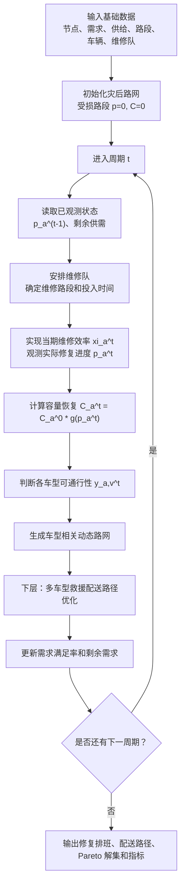

> 历史归档（2026-09-07）：保留研究演变记录；其中计划、数值和完成状态不代表当前实现。当前口径见 [研究说明](../research.md) 和 [实验进展](../experiments.md)。

# 拟研究模型文档：道路容量渐进恢复下的修复-配送协同优化

> 本文参考 `docs/algorithm_flow.md` 的结构，描述拟研究模型。模型创新点是：将灾后道路状态从二元可达扩展为容量随修复进度渐进恢复，并考虑不同车辆类型对道路恢复程度的通行要求。

## 1. 模型核心思想

原始模型可以理解为：

```text
道路未修好：不可通行
道路修好：恢复通行
```

拟研究模型改为：

```text
道路未修复：不可通行
道路临时抢通：小型车可低速通行
道路单车道限行：小型车和中型车可通行
道路基本恢复：大部分货车可通行
道路完全修复：所有车辆正常通行
```

因此，修路不再只影响“是否可达”，而是同时影响：

- 路段容量；
- 车辆类型是否可通；
- 车辆实际通行时间；
- 配送路径选择；
- 哪些受灾点可以先得到少量急需物资。

## 2. 模型结构

拟研究模型仍保持“道路修复 + 救援配送”的协同结构，但下层配送使用同时受车型通行阈值和路段周期吞吐上限约束的动态路网。本文不求解普通交通均衡，也不使用流量驱动的 BPR 拥堵函数；道路容量用于限制每周期可通过的救援车辆 pcu 总量。

```text
上层：维修队道路修复排班
状态层：根据修复进度更新道路容量和车型可通行性
下层：多车型救援物资配送路径优化
```

与 Li & Teo (2019) 的主要差异：

| 模块 | 原模型口径 | 拟研究口径 |
|---|---|---|
| 道路状态 | 二元可达或修复后可用 | 多阶段容量恢复 |
| 修复效果 | 修复完成后才充分影响配送 | 修复过程中即可部分影响配送 |
| 车辆类型 | 主要体现容量和数量 | 同时体现载重、数量、道路占用和通行阈值 |
| 配送路径 | 基于当期可达路网 | 基于当期容量和车型可通行路网 |
| 算法 | HSSPGA 或普通 GA 思路 | NSGA-II + ALNS 混合多目标算法 |

## 3. 集合与索引

| 符号 | 含义 |
|---|---|
| `N` | 节点集合 |
| `Ns` | 供给节点集合 |
| `Nq` | 需求节点集合 |
| `A` | 路段集合 |
| `Ar` | 受损路段集合 |
| `K` | 维修队集合 |
| `V` | 车辆类型集合 |
| `T` | 周期集合 |
| `P_m,i,v^t` | 周期 `t` 中车型 `v` 从供给点 `m` 到需求点 `i` 的候选可行路径集合 |

## 4. 主要参数

| 参数 | 含义 |
|---|---|
| `D_i` | 需求点 `i` 的需求量 |
| `S_m` | 供给点 `m` 的供给量 |
| `t_a^0` | 路段 `a` 的正常基础通行时间 |
| `C_a^0` | 路段 `a` 的正常容量 |
| `R_a` | 受损路段 `a` 完全修复所需时间 |
| `eta` | 单个周期长度 |
| `Q_v` | 车辆类型 `v` 的单车容量 |
| `N_v` | 车辆类型 `v` 的数量 |
| `theta_v` | 车辆类型 `v` 的最低道路修复进度要求 |
| `g(p)` | 道路容量恢复函数 |
| `s(p)` | 道路速度恢复函数 |
| `Delta t` | 单周期长度，当前为 8 小时 |
| `e_v` | 车型 `v` 的单车 pcu 当量；与原案例的车型类别 OD 流量区分 |
| `lambda_R` | 维修作业工时在效率目标中的权重；原型取 0.05，正式实验需做敏感性分析 |
| `xi_a^t` | 周期 `t` 路段 `a` 的实际维修效率，实现前未知、周期结束后观测；期望值为 1 |
| `M` | 大常数 |

### 4.1 维修队移动的范围假设

本文在周期级战略—战术层面优化维修队任务分配和道路修复排班，不单独优化维修队行驶路径。假设维修队已在受灾区域预部署，任务间转移、设备准备和现场布置时间相对于道路修复工时较小，或已合并计入路段完全修复时间 `R_a`。因此，维修队在任务切换时不另计移动时间，研究结论只针对该范围假设成立。

## 5. 决策变量

### 道路修复变量

| 变量 | 含义 |
|---|---|
| `x_a,k^t` | 周期 `t` 中维修队 `k` 是否维修受损路段 `a` |
| `w_a,k^t` | 周期 `t` 中维修队 `k` 投入到路段 `a` 的维修时间 |
| `p_a^t` | 周期 `t` 结束时路段 `a` 的累计修复进度 |
| `z_a^t` | 周期 `t` 结束时路段 `a` 是否完全修复 |

### 路网状态变量

| 变量 | 含义 |
|---|---|
| `C_a^t` | 周期 `t` 中路段 `a` 的当前容量 |
| `y_a,v^t` | 周期 `t` 中车辆类型 `v` 是否可通过路段 `a` |
| `tau_a,v^t` | 周期 `t` 中车辆类型 `v` 通过路段 `a` 的通行时间 |

### 救援配送变量

| 变量 | 含义 |
|---|---|
| `q_m,i,v^t` | 周期 `t` 中用车辆类型 `v` 从供给点 `m` 向需求点 `i` 配送的物资量 |
| `n_p,m,i,v^t` | 周期 `t` 中车型 `v` 沿路径 `p` 从 `m` 到 `i` 的车辆趟数 |
| `delta_a,p` | 路径 `p` 是否经过路段 `a` |
| `L_a^t` | 周期 `t` 内路段 `a` 被救援车辆占用的 pcu 总量 |
| `u_i^t` | 周期 `t` 结束时需求点 `i` 的累计满足量 |
| `r_i^t` | 周期 `t` 结束时需求点 `i` 的剩余未满足需求 |
| `h_i^t` | 周期 `t` 中需求点 `i` 的满足率 |
| `route_v^t` | 周期 `t` 中车辆类型 `v` 的配送路径集合 |

## 6. 道路容量渐进恢复

### 6.1 修复进度

受损路段 `a` 的实际修复进度由维修投入与当期实际维修效率共同决定：

```text
p_a^t = min(1, p_a^(t-1) + xi_a^t * Σ_k w_a,k^t / R_a)
```

期初制定决策时使用 `E[xi_a^t]=1`；周期结束后观测实际 `p_a^t`。天气、余震、设备状态和现场损毁误差可使 `xi_a^t` 偏离 1，因而实际容量阶段、车型可通行性和期初预测可能不同。原型采用对称均匀场景 `xi_a^t ~ U(1-delta, 1+delta)`，默认 `delta=0.30`；该分布仅用于机制验证，正式研究需以历史记录、专家区间或稳健性分析标定。

其中：

- `p_a^t = 0` 表示完全未修复；
- `p_a^t = 1` 表示完全修复；
- `0 < p_a^t < 1` 表示部分恢复。

### 6.2 容量恢复函数

第一版使用分段吞吐恢复函数，并将速度恢复系数作为独立参数。当前原型中二者取相同默认值，以保持参数数量可控；正式实验应分别做敏感性分析。

```text
g(p) =
  0.00, 0 <= p < 0.30
  0.30, 0.30 <= p < 0.60
  0.60, 0.60 <= p < 0.80
  0.80, 0.80 <= p < 1.00
  1.00, p = 1.00
```

当前容量：

```text
C_a^t = C_a^0 * g(p_a^t)
```

周期 `t` 内可供救援车辆使用的路段吞吐上限为：

```text
B_a^t = C_a^0 * g(p_a^t) * Delta t
```

其中 `C_a^0` 的单位是 pcu/h，`B_a^t` 的单位是 pcu/周期。

对于未受损道路：

```text
p_a^t = 1
C_a^t = C_a^0
```

### 6.3 车型可通行约束

车辆类型 `v` 能否通过路段 `a` 取决于道路修复进度：

```text
y_a,v^t = 1, if p_a^t >= theta_v
y_a,v^t = 0, if p_a^t < theta_v
```

例如：

| 车辆类型 | 最低通行进度 |
|---:|---:|
| 小型车 | 0.30 |
| 中型车 | 0.50 |
| 大型车 | 0.70 |
| 重型车 | 0.80 |

这使得同一条路在不同修复阶段可服务不同车型。

### 6.4 通行时间计算

在不求解普通交通拥堵的前提下，通行时间由独立的速度恢复函数决定：

```text
tau_a,v^t = t_a^0 / [s(p_a^t) * speed_factor_v], if y_a,v^t = 1
tau_a,v^t = INF, if y_a,v^t = 0
```

`g(p)` 控制能通过多少车辆，`s(p)` 控制车辆通过需要多长时间，二者不再在概念上混为同一变量。若未来取得普通交通 OD 数据，可再升级为 BPR 函数：

```text
tau_a,v^t = t_a^0 * [1 + alpha * (f_a,v^t / C_a^t)^beta]
```

其中 `f_a,v^t` 可由各车型路径趟数和单车 pcu 当量 `e_v` 汇总计算。

### 6.5 路段周期吞吐约束

若一趟 `m -> i` 的车型 `v` 配送经过路段 `a`，则该趟运输占用 `e_v` 个 pcu。路段周期占用量为：

```text
L_a^t = Σ_m Σ_i Σ_v Σ_p delta_a,p * e_v * n_p,m,i,v^t
```

并满足：

```text
L_a^t <= B_a^t = C_a^0 * g(p_a^t) * Delta t
```

当前路网按无向路段处理，因此两个方向共享同一周期吞吐上限。实验代码维护每期路段剩余 pcu；车型 `v` 沿路径 `p` 执行 `n_p,m,i,v^t` 趟配送后，从路径经过的全部路段扣减 `e_v * n_p,m,i,v^t`。若当前最短路径容量不足，则在残余容量路网中重新寻找可行绕行路径。

## 7. 目标函数

拟研究建议采用多目标形式，与 NSGA-II + ALNS 算法匹配。

### 目标 1：最小化累计未满足需求

```text
min F1 = Σ_t Σ_i r_i^t
```

该目标体现救援效果。

### 目标 2：最小化加权配送—抢修时间成本

```text
min F2 = Σ_t 配送车辆通行时间 + lambda_R * Σ_t 维修队有效作业工时
```

该目标体现配送效率与规划期内抢修投入之间的权衡。原型代码取 `lambda_R=0.05`，不包含独立的维修队移动时间；移动、准备和现场布置时间按照第 4.1 节假设吸收到 `R_a`。正式实验应报告 `lambda_R` 的归一化依据或敏感性结果。

### 目标 3：最大化公平性

可以用最小满足率表示：

```text
max F3 = min_i (u_i^T / D_i)
```

也可以转化为最小化满足率差异：

```text
min F3' = max_i h_i^T - min_i h_i^T
```

第一版建议使用 `min_i (u_i^T / D_i)`，便于与 Li & Teo 的最大相对满意度思想衔接。

## 8. 主要约束

### 8.1 维修队时间约束

每支维修队每个周期可投入的维修时间不超过周期长度：

```text
Σ_a w_a,k^t <= eta
```

### 8.2 修复进度约束

修复进度不能超过 1：

```text
0 <= p_a^t <= 1
```

并且随周期非递减：

```text
p_a^t >= p_a^(t-1)
```

### 8.3 供给约束

每个供给点累计发出物资不能超过其供给量：

```text
Σ_t Σ_i Σ_v q_m,i,v^t <= S_m
```

### 8.4 需求约束

每个需求点累计获得物资不能超过需求量：

```text
u_i^t <= D_i
```

剩余需求：

```text
r_i^t = D_i - u_i^t
```

### 8.5 车辆趟数与运量约束

配送量由车辆趟数限制：

```text
q_m,i,v^t <= Q_v * Σ_p n_p,m,i,v^t
Σ_m Σ_i Σ_p n_p,m,i,v^t <= N_v
```

第一版假设每辆车每周期最多执行一趟配送；若后续显式加入往返时间，可将第二式改为车辆时间资源约束。

### 8.6 路径可通行约束

如果路径包含路段 `a`，则该车辆类型必须满足：

```text
y_a,v^t = 1
```

否则该路径不可用。

### 8.7 路段周期吞吐约束

```text
Σ_m Σ_i Σ_v Σ_p delta_a,p * e_v * n_p,m,i,v^t
    <= C_a^0 * g(p_a^t) * Delta t
```

该约束使道路正常容量、修复阶段、车型 pcu 和多条路径对瓶颈路段的竞争真正进入配送可行性判断。

### 8.8 动态路网更新约束

每个周期结束后，根据维修队投入时间更新：

```text
repair plan -> p_a^t -> C_a^t -> y_a,v^t -> tau_a,v^t -> routes
```

这条更新链是本模型区别于二元道路模型的核心。

### 8.9 信息结构与非预见性

周期 `t` 的维修与配送重规划只能使用截至 `t-1` 期末已观测的信息，不能预先使用 `xi_a^t`。决策时序为：

```text
观测 p_a^(t-1) 和剩余供需
    -> 制定本期维修投入
    -> 实现 xi_a^t 并观测 p_a^t
    -> 更新容量、车型可通行性和配送路径
    -> 进入下一周期
```

开放环策略在 `t=0` 按 `E[xi]=1` 生成完整计划，执行中不因实际修复偏差改变维修安排；滚动策略在每期开始时根据已观测的实际道路状态重算剩余计划。若 `delta=0`，两者没有新增信息差异，合理实现下其状态路径应一致或接近；只有 `delta>0` 时，二者差异才可解释为道路状态信息的价值。

## 9. 周期运行逻辑



## 10. 一个示例

假设路段 `a` 完全修复时间为 900 分钟，正常容量为 1000 pcu/h，周期长度为 480 分钟。

第 1 期维修后：

```text
p_a^1 = 480 / 900 = 0.533
g(p_a^1) = 0.30
C_a^1 = 300 pcu/h
B_a^1 = 300 * 8 = 2400 pcu/period
```

此时：

```text
小型车 theta=0.30，可通行
中型车 theta=0.50，可通行
大型车 theta=0.70，不可通行
重型车 theta=0.80，不可通行
```

第 2 期维修完成后：

```text
p_a^2 = 1.000
g(p_a^2) = 1.00
C_a^2 = 1000 pcu/h
所有车辆可通行
```

这个例子说明：道路在完全修复前已经能对救援配送产生作用。

若某批配送需要 100 趟、单车当量为 1.5 pcu，则该批配送占用 150 pcu；只有在路径上每条路段的剩余周期容量均不低于 150 pcu 时才可执行。这里的单车 pcu 当量是新增的场景或标定参数，不能直接使用原案例中 300/500/800/1000 pcu/h 的车型类别 OD 流量代替。

## 11. 与原模型的对比实验

建议设置以下实验组：

| 实验组 | 道路状态 | 车辆类型约束 | 用途 |
|---|---|---|---|
| Baseline | 二元可达 | 只考虑容量和数量 | 对照 Li & Teo 思路 |
| Model A | 容量渐进恢复 | 不区分车型通行阈值 | 验证容量恢复本身的价值 |
| Model B | 容量渐进恢复 | 区分车型通行阈值 | 验证完整创新模型 |
| Model C | 容量渐进恢复 | 区分车型，并加入 ALNS 强化 | 验证算法改进效果 |
| Expected-state open-loop | 容量渐进恢复 | 按 `E[xi]=1` 预先制定全期计划 | 不使用实际道路状态反馈的策略基准 |
| Rolling-state policy | 容量渐进恢复 | 每期依据已观测修复进度重规划 | 识别道路状态信息的价值 |

`open-loop` 与 `rolling` 必须在相同的 `xi_a^t` 随机实现上成对比较。正式实验还应增加“完全信息方案”作为不可实施的性能上界，并以 regret 或 EVPI 类指标衡量策略与上界的差距；当前原型只实现前两类策略，不把一步前瞻滚动启发式表述为全局最优。

评价指标：

- 累计未满足需求；
- 最小需求满足率；
- 总配送时间；
- 道路恢复完成时间；
- 车辆利用率；
- 最大路段利用率、容量超过 80% 的边—周期数；
- 因容量不足无法执行的配送量；
- Pareto 解集质量；
- 算法运行时间。
- 修复进度预测误差、滚动重排次数及 open-loop/rolling 成对绩效差；

### 11.1 容量有效性检查

容量约束必须同时报告“是否存在”和“是否绑定”。正式实验除基准 `capacity_scale=1.00` 外，至少设置中、低两档有效容量情景，并报告最大边—周期利用率、利用率不低于 80% 的边—周期数及容量阻塞配送量。当前 S8 实现检查表明：基准尺度最大利用率约为 5.7%，约束不绑定；`capacity_scale=0.05` 时最大利用率达到 1.0，但仍可通过绕行或跨期配送完成目标；`capacity_scale=0.02` 时出现正的容量阻塞配送量。上述缩放值是压力测试参数，不是现场观测值，不能作为汶川道路实际容量结论。

## 12. 推荐论文表述

模型创新可以写成：

> 将灾后道路状态由传统二元可达变量扩展为基于修复进度的容量渐进恢复变量，刻画道路从完全中断、临时抢通、限行通行到完全恢复的动态过程；进一步引入异质救援车辆的最低通行阈值，使配送路径选择同时受道路恢复进度、当前容量和车辆类型约束影响。

这个表述比单纯“考虑道路受损”更明确，也能和已有道路可靠性、道路损毁率、鲁棒 LRP 文献区分开。
