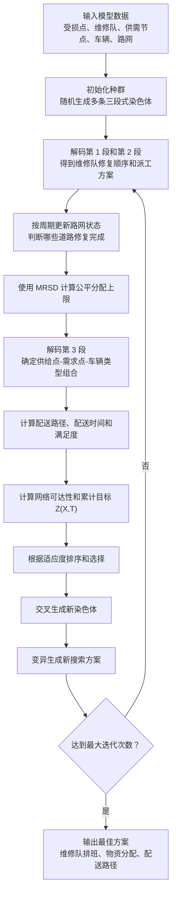

# 遗传算法实现说明：编码、解码与遗传操作

> 基于论文 `s10479-018-3037-2.pdf` 第 5 节 HSSPGA 方法整理。本文重点说明：模型数据如何编码成染色体、染色体如何解码成修路和配送方案、遗传算法如何选择、交叉、变异。

## 1. 遗传算法在模型里的作用

论文中的问题很复杂：既要安排维修队修路，又要安排救援物资配送。严格求精确最优解很难，因此作者使用 HSSPGA，即基于最大相对满意度的稳态并行遗传算法。

遗传算法的基本思想是：

```text
把一个候选方案编码成一条染色体；
随机生成很多候选方案；
评价每个方案好不好；
让好的方案更容易留下；
通过交叉和变异产生新方案；
反复迭代，寻找更好的修路和配送策略。
```

## 2. 一条染色体代表什么

论文把一条染色体分成三段：

```text
染色体 = [第 1 段：修路顺序 | 第 2 段：维修队分配 | 第 3 段：配送组合优先级]
```

| 染色体段 | 编码内容 | 对应数据 |
|---|---|---|
| 第 1 段 | 受损道路/受损节点的修复顺序 | 受损节点表 |
| 第 2 段 | 每个受损节点由哪支维修队修 | 维修队资源表 |
| 第 3 段 | 供给点、需求点、车辆类型组合的配送优先级 | 供需节点表、车辆表 |

## 3. 第 1 段：修路顺序编码

第 1 段表示所有受损节点的访问顺序。

如果有 `|Nr|` 个受损节点，那么第 1 段长度就是：

```text
|Nr|
```

它是一个不重复整数排列。例如有 5 个受损节点：

```text
第 1 段 = 3 5 1 4 2
```

含义是：

```text
优先考虑受损点 3，然后是 5，然后是 1，然后是 4，最后是 2
```

在汶川案例中，受损节点来自表 2，共 16 个，因此第 1 段可以看成 1 到 16 的一个排列。

## 4. 第 2 段：维修队分配编码

第 2 段与第 1 段一一对应，表示第 1 段中每个受损节点由哪支维修队负责。

如果有 `|Nr|` 个受损节点，那么第 2 段长度也是：

```text
|Nr|
```

每个基因的取值是维修队编号。例如：

```text
第 1 段 = 3 5 1 4 2
第 2 段 = 1 1 2 2 1
```

两段配对后得到：

| 顺序位置 | 受损节点 | 维修队 |
|---:|---:|---:|
| 1 | 3 | 1 |
| 2 | 5 | 1 |
| 3 | 1 | 2 |
| 4 | 4 | 2 |
| 5 | 2 | 1 |

解码后：

```text
维修队 1：先修 3，再修 5，再修 2
维修队 2：先修 1，再修 4
```

这两段合起来，就形成了上层道路修复排班策略 `X`。

## 5. 第 3 段：救援配送组合优先级编码

第 3 段表示救援物流分配的优先级。

它不是直接写“给某个需求点送多少吨”，而是对所有可能的配送组合排序。

一个配送组合由三部分组成：

```text
供给点 m + 需求点 n + 车辆类型 v
```

因此第 3 段长度是：

```text
|Ns| × |Nq| × |V|
```

其中：

- `|Ns|`：供给点数量
- `|Nq|`：需求点数量
- `|V|`：车辆类型数量

在汶川案例中：

```text
供给点数量 = 3
需求点数量 = 35
车辆类型数量 = 4
```

所以第 3 段长度为：

```text
3 × 35 × 4 = 420
```

第 3 段也是一个不重复整数排列。解码时，算法会按优先级依次尝试这些组合：

```text
这个供给点还有物资吗？
这个需求点还需要物资吗？
这种车辆还有剩余吗？
当前路网下路径是否可达？
```

如果满足条件，就分配物资和车辆；如果不满足，就跳过或置零。

## 6. MRSD 如何参与配送分配

论文不是让第 3 段任意分配物资，而是先用 MRSD 计算公平分配上限。

MRSD 是 maximum relative satisfaction degree，可以理解为最大相对满意度方法。它的目标是让各需求点的满足比例尽量接近。

满足度定义为：

```text
满足度 = 已分配物资 / 需求量
```

例如节点 8：

```text
需求量 D = 382
分配量 = 305
满足度 = 305 / 382 ≈ 79.84%
```

MRSD 的作用是：

```text
先确定每个需求点大致最多应该获得多少物资，避免分配严重不公平；
再由第 3 段决定由哪个供给点、用哪类车、按什么优先级配送。
```

## 7. 一条染色体如何解码成完整方案

一条染色体解码后，会得到两类结果。

上层结果：

```text
每支维修队的受损点访问顺序
每个周期哪些道路可能修复完成
每期更新后的道路网络状态
```

下层结果：

```text
每个需求点从哪个供给点获得物资
每个需求点获得多少物资
使用哪类车辆
当前路网下走哪条配送路径
配送需要多少时间
```

整体解码流程可以理解为：

```text
第 1 段 + 第 2 段 -> 维修队排班
维修队排班 -> 每期路网状态
每期路网状态 + 第 3 段 + MRSD -> 救援配送方案
配送方案 + 路径计算 -> 可达性和配送时间
```

## 8. 适应度如何计算

遗传算法需要评价每条染色体好不好。论文核心评价依据是上层目标，也就是累计可达性：

```text
Z(X,T)
```

直观含义是：

```text
关键道路越早修通；
需求大的节点越早可达；
配送路径越早恢复；
方案越好。
```

论文还使用适应度排序公式：

```text
Fit(Pos) = (2 - SP) + 2(SP - 1)(Pos - 1) / (Popsize - 1)
```

其中：

- `Pos`：染色体在排序中的位置
- `SP`：选择强度，取值范围为 `[1.0, 2.0]`
- `Popsize`：种群规模

可以简单理解为：算法先按目标值给染色体排序，再用排序位置计算选择概率。表现更好的染色体更容易进入下一代。

## 9. 选择、交叉和变异

论文使用的遗传操作如下。

| 操作 | 用法 |
|---|---|
| 选择 | 轮盘赌选择 |
| 第 1 段交叉 | 两点交叉 |
| 第 2 段交叉 | 单点交叉 |
| 第 3 段交叉 | 两点交叉 |
| 第 1 段变异 | 逆序变异 |
| 第 2 段变异 | 交换变异 |
| 第 3 段变异 | 逆序变异 |

### 选择

选择操作决定哪些染色体可以进入下一轮繁殖。

论文采用轮盘赌选择：

```text
适应度越高，被选中的概率越大；
适应度较低，也仍然有小概率被选中。
```

这样可以避免算法太早只围绕一个局部方案搜索。

### 交叉

交叉相当于把两个已有方案的一部分组合起来，生成新方案。

第 1 段和第 3 段是“不重复整数排列”，所以使用两点交叉时要避免重复基因。例如第 1 段里受损点编号不能重复，也不能缺失。

第 2 段只是维修队编号，可以重复，因此使用单点交叉即可。

### 变异

变异用于制造新的搜索方向。

第 1 段逆序变异例子：

```text
原顺序：3 5 1 4 2
选中中间一段反转
新顺序：3 4 1 5 2
```

这表示修路顺序发生变化。

第 2 段交换变异例子：

```text
原分配：1 1 2 2 1
交换两个位置
新分配：1 2 2 1 1
```

这表示某些受损点改由不同维修队负责。

## 10. 算法整体流程



## 11. 论文使用的主要参数

论文数值实验中采用的遗传算法参数包括：

| 参数 | 含义 | 取值 |
|---|---|---:|
| `Popsize` | 种群规模 | 100 |
| `Maxgen` | 最大迭代次数 | 300 |
| `pc` | 交叉概率 | 0.9 |
| `pm` | 变异概率 | 0.1 |
| `SP` | 选择强度 | 1.2 |
| `ρ` | 救援物流与普通交通流权重 | 0.5 |

当前简化复现版本如果暂不考虑普通交通 OD，可以先把重点放在：

```text
受损点修复顺序
维修队分配
救援物资分配
配送路径
```

## 12. 一句话总结

遗传算法在这里做的事情是：

```text
把“怎么修路、谁去修、怎么配送”编码成染色体；
不断生成、筛选和修改方案；
用累计可达性、物资满足度和配送时间评价方案；
最终找到一个足够好的灾后修路与救援物流联动策略。
```

