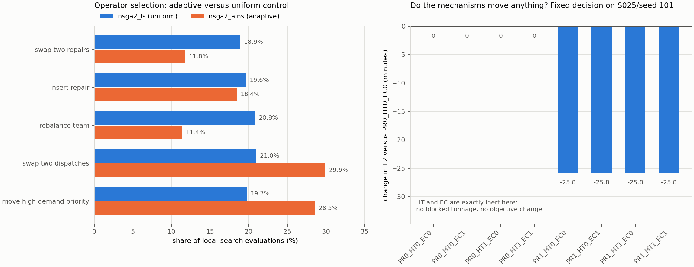

# v2 小预算诊断报告

日期：2026-09-20。分支 `claude/v2-evaluation-contract`，基于 `1a1a5d5`。
本报告只记录**实际执行**的内容：真实命令、真实退出状态、真实产物。未完成或未支持的部分明确标出，不推断、不补图。

模型语义见[模型 v2 合同](model_v2_contract.md)，阶段状态见[执行状态表](execution_status_v2.md)。

---

## 1. 测试

| 项目 | 基线（`1a1a5d5`） | 本次最终 |
|---|---:|---:|
| `uv run python -m unittest discover -s tests -v` | 21 个，21 通过，0 失败，0 错误 | **63 个，63 通过，0 失败，0 错误** |
| 其中 `tests/legacy/` | 2 个，通过（被 discover 发现） | 2 个，通过（未改动） |

新增回归覆盖：`tests/test_model_contract.py`（M01–M11，12 例）、`tests/test_solution_io.py`（11 例）、
`tests/test_search_contract.py`（13 例）、`tests/test_common_execution.py`（8 例）。
旧断言未被删除、放宽或改预期值。

## 2. 执行的命令

```bash
# P5-A 全量测试 + v2 极小烟雾
uv run python -m unittest discover -s tests -v
uv run python scripts/reproduce/run_benchmark.py \
  --suite smoke --cases S020 --instance-seeds 101 \
  --model-version v2 --solver-repeats 1 \
  --algorithms nsga2 nsga2_ls nsga2_alns \
  --max-evaluations 12 --pop-size 4 \
  --output-dir outputs/claude_v2/smoke

# P5-B 算法诊断
uv run python scripts/reproduce/run_benchmark.py \
  --suite benchmark --cases S025 \
  --model-version v2 --instance-seeds 101 102 \
  --solver-repeats 3 --solver-seed-start 50000 \
  --algorithms nsga2 nsga2_ls nsga2_alns \
  --max-evaluations 500 --pop-size 32 \
  --output-dir outputs/claude_v2/pilot_algorithm
uv run python scripts/reproduce/replay_solutions.py \
  --input-root outputs/claude_v2/pilot_algorithm \
  --execution-model saved \
  --output-dir outputs/claude_v2/pilot_algorithm_roundtrip

# P5-C 模型价值诊断
uv run python scripts/reproduce/run_model_ablation.py \
  --suite benchmark --cases S025 \
  --model-version v2 --algorithm nsga2 \
  --model-ids PR1_HT1_EC1 PR0_HT1_EC1 PR1_HT0_EC1 PR1_HT1_EC0 \
  --instance-seeds 101 --solver-repeats 2 \
  --solver-seed-start 50000 --max-evaluations 200 --pop-size 16 \
  --output-dir outputs/claude_v2/pilot_planning
uv run python scripts/reproduce/replay_solutions.py \
  --input-root outputs/claude_v2/pilot_planning \
  --execution-model full \
  --output-dir outputs/claude_v2/pilot_common_execution

# 诊断图（只读上述真实 CSV 与运行记录）
uv run python scripts/reproduce/plot_pilot_diagnostics.py
```

全部命令退出码 0。运行记录数：smoke 3、pilot_algorithm 18、pilot_planning 8；两个 replay 各 0 失败。

## 3. 评价预算核对

| 项目 | 数值 |
|---|---|
| pilot_algorithm 运行数 | 18（3 算法 × 2 实例种子 × 3 solver 重复） |
| 每运行预算 | `max_evaluations=500`，`pop_size=32` |
| 实际评价数（三算法合计） | **9 000**，逐运行均为 500 |
| 终止原因 | 全部 `budget_exhausted`，无提前终止、无伪造预算 |
| 缓存命中（合计） | 296（缓存命中不计入 9 000） |
| 真实局部搜索评价（合计） | 3 278 |
| pilot_planning 运行数 | 8（4 规划模型 × 2 配对求解），逐运行评价 200 |

局部搜索评价计入同一预算：`nsga2_ls` 与 `nsga2_alns` 各自 500 次评价中约 55% 发生在局部搜索内。

## 4. 算法诊断（S025，种子 101/102，各 3 次求解）

三组算法的对比**不足以做任何排名或显著性结论**（每算法 6 次运行、单一实例规模）。

| 算法 | 运行 | HV 均值 | HV 标准差 | IGD 均值 | 非支配点数均值 | 运行时长均值/s |
|---|---:|---:|---:|---:|---:|---:|
| `nsga2` | 6 | 1.0669 | 0.0992 | 0.1517 | 32.2 | 10.33 |
| `nsga2_ls` | 6 | 0.9633 | 0.0651 | 0.1521 | 23.3 | 10.40 |
| `nsga2_alns` | 6 | 1.0104 | 0.0847 | 0.1599 | 22.3 | 11.06 |

HV/IGD 使用每个实例 pooled 参考前沿与参考点 `(1.1, 1.1, 1.1)`；区间重叠，且 n=6，**不能据此声称混合算法更优或更差**。

**算子贡献**（占各组局部搜索评价的比例）：

| 算子 | `nsga2_ls`（均匀） | `nsga2_alns`（自适应） |
|---|---:|---:|
| `swap_two_repairs` | 18.9% | 11.8% |
| `insert_repair` | 19.6% | 18.4% |
| `rebalance_team` | 20.8% | 11.4% |
| `swap_two_dispatches` | 21.0% | 29.9% |
| `move_high_demand_priority` | 19.7% | 28.5% |

均匀对照组按设计接近 20% 且无偏好；自适应组明显偏向配送类算子（29.9% / 28.5%）而压低队伍与维修顺序类算子（11.4% / 11.8%）。
这是**行为差异**的证据，不是性能优势的证据。

**目标同值情况**：`nsga2` 193 个 Pareto 点中 114 个目标三元组互不相同（59%），`nsga2_ls` 93/140（66%），
`nsga2_alns` 91/134（68%）。三组的 `zero_service_ratio` 均为 0（S025 上不存在零服务需求点）。

**同模型回放一致性**：467 个已保存决策在 `--execution-model saved` 下全部重算一致，
最大绝对误差 F1/F2/F3 均为 **0.0**，最大相对误差 F1 为 **0.0**（容差 1e-8）。

## 5. 模型价值诊断（四规划组，同一物理实例）

四组共享同一 `physical_instance_hash`（已验证唯一），使用相同的预算、配给政策、时间轴与配对 solver seed。

下图（`outputs/claude_v2/pilot_diagnostics.png`）左为算子贡献，右为固定决策下各机制对目标的影响。
该图已随本报告一并纳入版本控制；图中数值可由 §2 的 `plot_pilot_diagnostics.py` 命令从真实 CSV 与运行记录重新生成：



固定一个 SPT 决策、逐个模型评价（`outputs/claude_v2/pilot_planning/fixed_decision_mechanism_binding.csv`）：

| 模型 | F1 | F2（分钟） | 容量受阻吨位 | 最大边利用率 | 总配送吨 | 总趟次 |
|---|---:|---:|---:|---:|---:|---:|
| PR0_HT0_EC0 | 3.9813 | 3588.5 | 0.0 | 0.0000 | 1018.8 | 128 |
| PR0_HT0_EC1 | 3.9813 | 3588.5 | 0.0 | 0.0341 | 1018.8 | 128 |
| PR0_HT1_EC0 | 3.9813 | 3588.5 | 0.0 | 0.0000 | 1018.8 | 128 |
| PR0_HT1_EC1 | 3.9813 | 3588.5 | 0.0 | 0.0341 | 1018.8 | 128 |
| PR1_HT0_EC0 | 3.9813 | 3562.7 | 0.0 | 0.0000 | 1018.8 | 128 |
| PR1_HT0_EC1 | 3.9813 | 3562.7 | 0.0 | 0.0341 | 1018.8 | 128 |
| PR1_HT1_EC0 | 3.9813 | 3562.7 | 0.0 | 0.0000 | 1018.8 | 128 |
| PR1_HT1_EC1 | 3.9813 | 3562.7 | 0.0 | 0.0341 | 1018.8 | 128 |

**结论（限于该实例与该标定，不外推）**：

1. **渐进恢复（PR）有效**：在完全相同决策下 F2 改善 25.8 分钟（3588.5 → 3562.7）。F1/F3 不变。
2. **异质车型阈值（HT）在该实例上完全无效**：`HT0` 与 `HT1` 的全部行为指标逐位相同。在 PR0（二元恢复）下 HT 必然无效，
   已由回归测试固定；此处 PR1 下仍然无效。
3. **边容量（EC）在该实例上不构成约束**：开启后最大边利用率仅 0.0341，容量受阻吨位为 0，
   目标、配送量与趟次完全不变。绑定的资源是**车队趟次预算**（9 期共 128 趟），不是道路吞吐。

四规划组在同一 solver seed 下得到**完全相同**的代表目标三元组（如 seed 1060000 四组均为 F1=4.323837、F2=3780.4318）。
四组之间的差异只体现在近似前沿的规模（35/45/37/35 个非支配点），不在代表解的目标值上。

**统一执行回放**：152 个规划决策在 Full 环境（v2 + PR1 + HT1 + EC1）中重算，0 失败。

| 规划组 | 解数 | 规划 F1 均值 | 执行 F1 均值 | ΔF1 | 规划 F2 均值 | 执行 F2 均值 | ΔF2 |
|---|---:|---:|---:|---:|---:|---:|---:|
| PR1_HT1_EC1（Full） | 35 | 3.9007 | 3.9007 | +0.0000 | 3305.7 | 3305.7 | +0.0 |
| PR0_HT1_EC1 | 45 | 3.9109 | 3.9109 | +0.0000 | 3328.2 | 3327.9 | −0.3 |
| PR1_HT0_EC1 | 37 | 3.9243 | 3.9250 | +0.0007 | 3333.2 | 3333.5 | +0.3 |
| PR1_HT1_EC0 | 35 | 3.9007 | 3.9007 | +0.0000 | 3305.7 | 3305.7 | +0.0 |

Full 组自身的规划目标与执行回放**逐位一致**（最大绝对差 0.00e+00），证明回放管线无自引入误差。
其余三组的执行修正量 ≤0.0007（F1）与 ≤0.3 分钟（F2），与第 5 节"HT/EC 在本实例不绑定"的结论一致。
`PR1_HT1_EC0` 与 `PR1_HT1_EC1` 的数值完全相同，正是 EC 不绑定的直接后果。

**四模型子集不输出正式统计**：`factor_effects.csv` 等四份表格只写入
`formal_analysis=not_applicable` 与原因，未计算主效应、交互或显著性。完整八组合 + `nsga2_alns` 入口保持可用。

## 6. 产物路径与校验

根目录 `outputs/claude_v2/`。**该目录已纳入版本控制**，克隆仓库后无需重算即可核对本报告的全部数值；
`outputs/` 下的其他目录仍被忽略。

| 产物 | 路径 |
|---|---|
| 基线 legacy smoke（P0） | `baseline_legacy/` |
| v2 烟雾 | `smoke/`（`runs/`、`instances/`、`executions/`、`runs.csv`、`solutions.jsonl`、`pareto_points.csv`、`convergence.csv`、`experiment_manifest.json`） |
| 算法诊断 | `pilot_algorithm/`（18 个完整运行单元） |
| 算法回放 | `pilot_algorithm_roundtrip/replay_results.csv`、`replay_summary.json` |
| 模型诊断 | `pilot_planning/`（8 个完整运行单元）、`fixed_decision_mechanism_binding.csv` |
| 统一执行回放 | `pilot_common_execution/replay_results.csv`、`replay_summary.json` |
| 诊断图 | `pilot_diagnostics.png` |

每个运行单元含完整实例快照、生效评价配置、三段完整决策、原始三目标与全部指标、收敛记录、预算、实际评价数与诊断计数、
代码指纹；`runs/<run_key>.json` 自带 `record_sha256` 完整性校验，`instances/` 与 `executions/` 各带 `snapshot_sha256`。
`runs.csv`、`solutions.jsonl`、`pareto_points.csv`、`convergence.csv` 均可由运行文件再生。

上表路径均相对仓库根目录，且已纳入版本控制。manifest 中的 `git_sha`/`git_dirty` 记录的是**产生该结果时**的代码状态，
不会随之后的提交改变，因此可以直接判断产物与哪一版代码对应。

## 7. 仍未解决的问题

1. **粗时间离散**。v2 在期初采样路况、按周期吞吐限流，不建模排队与精确流入时间。这是近似，不是交通仿真。
2. **外生运力**。每期车辆趟次预算外生给定，不模拟同一实体车队的跨期位置与返程。
3. **无转场、无维修队可达性**。两项均为 0，v2 在收到非零值时报错而非支持。
4. **启发式配送**。配送仍由共享启发式解码器生成，不宣称求得完整 VRP 或最优物资分配。
5. **参数未标定**。`capacity_scale`、`repair_time_weight`、车队规模比例均为项目情景参数。
6. **P5 诊断规模很小**。S025 单实例（+种子 102）、每次求解至多 500 次评价、每算法 6 次运行；
   四模型诊断只有 1 个实例种子 × 2 次配对求解。不足以支持任何统计推断。
7. **机制在当前标定下不绑定**。HT 与 EC 在 S025 + `capacity_scale=0.05` 下无效；
   未做时间步长敏感性，也未重跑 `capacity_scale` 敏感性以定位绑定边界。
   P4 的回归测试（`capacity_scale=0.0002`）证明 EC 在吞吐受限时确实生效，但那是合成微案例，不是诊断结果。
8. **汶川网络未进入 v2 诊断**。WEN38 只在单决策探查中比较过 legacy/v2（见下），未做算法或模型诊断。

## 8. 不得据此宣称的结论

- 不得声称 `nsga2_alns` 或 `nsga2_ls` 优于 `nsga2`：6 次运行、单一规模、HV/IGD 区间重叠。
- 不得声称"自适应局部搜索无效"：本轮的证据只有行为差异（算子偏好），没有功效足够的性能检验。
- 不得声称 v2 优于 legacy。两者是不同语义，不是同一问题的两个解法。
- 不得把 HT/EC 在本实例不绑定解读为机制不重要——只能说明在该实例与该标定下它们不改变结果。
- 不得把 P5 完成写成 publication 完成，也不得把 Full 执行环境称为已现场标定的客观现实。
- 不得把维修总工时称为维修 makespan。

## 9. 下一阶段建议（仅基于本轮结果）

1. **先定位机制绑定边界**：在 S025/S050 上扫描 `capacity_scale` 与车队规模比例，找出 EC 与 HT 开始改变决策和目标的区间，
   再据此选择模型价值诊断的实例标定。当前标定下 EC/HT 的效应恒为 0，继续在该点扩大样本量不会产生信息。
2. **把阈值差异放到会绑定的场景**：HT 需要"部分恢复即可通行"与"必须完全恢复"的差别在配送期内实际出现；
   可考虑更长的单程时间或更长的维修时长，使期初路况在多个周期内保持中间状态。
3. **正式设计仍按 P6 执行**：开发/正式实例种子分离、预算由开发集决定、统一执行回放为主表、
   合成网络按实例配对、WEN38 只作单实例重复。本轮不启动。
4. **补 legacy 与 v2 的对照汇总**：本轮只在单决策上比较过两者（WEN38 上 v2 的 `final_min_satisfaction` 为 0 而 legacy 为 0.7973，
   因为 legacy 的逐点上限恰好等于全局供需比，v2 取消后最小满足率下降、聚合配送略增）。
   这是一项**配给政策差异**，需要独立诊断，不能与搜索算法比较混在一起。
