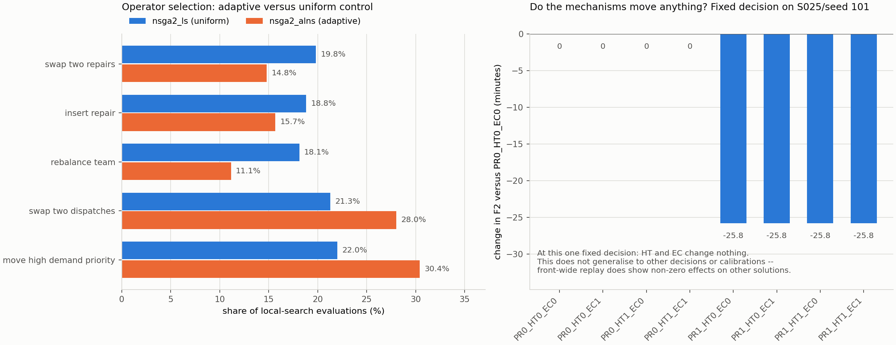

# v2 小预算诊断报告

日期：2026-09-20。分支 `main`，初始实现基于 `1a1a5d5`，复审修正后重跑基于 `bcf833d3` 之后的提交。
本报告只记录**实际执行**的内容：真实命令、真实退出状态、真实产物。未完成或未支持的部分明确标出，不推断、不补图。

模型语义见[模型 v2 合同](model_v2_contract.md)，阶段状态见[执行状态表](execution_status_v2.md)。

> ## ⚠ 复审修正（R1–R5）与本文数值的重跑
>
> 首轮 P0–P5 提交后审读发现五处问题，均已核实、修复并重跑。**本报告的全部数值已用修正后的代码在
> `outputs/claude_v2_reviewfix/` 重新生成**；修正前的产物保留在 `outputs/claude_v2/` 作为对照，不再作为结论依据。
>
> 最重要的一项：v2 目标原以原始浮点值比较，导致**每一个已保存决策集的代表方案都由 1e-13 量级的舍入噪声选出**
> （18/18 运行）。修正后代表方案的 F1 平均由 **4.1244 改善到 3.7933**（−8.0%）。
> 这一变化来自**修正目标比较规则**，不是算法改进，也不是模型变化。
>
> 修正清单与每项的验证见 §10。**本节以下所有小节均为修正后的数值。**

---

## 1. 测试

| 项目 | 基线（`1a1a5d5`） | P0–P5 首次交付 | 复审修正后（最终） |
|---|---:|---:|---:|
| `uv run python -m unittest discover -s tests -v` | 21 个，21 通过 | 63 个，63 通过 | **110 个，110 通过，0 失败，0 错误** |
| 其中 `tests/legacy/` | 2 个，通过（被 discover 发现） | 2 个，通过 | 2 个，通过（未改动） |

> 首次交付时本报告写的是 63——那是当时的真实数量；之后又补了 R1–R5 的回归用例，现为 110。

新增回归覆盖（按加入顺序）：`tests/test_model_contract.py`（M01–M11，12 例）、`tests/test_solution_io.py`（13 例）、
`tests/test_search_contract.py`（14 例）、`tests/test_common_execution.py`（8 例）、
`tests/test_objective_precision.py`（17 例）、`tests/test_experiment_contract.py`（9 例）、
`tests/test_full_execution_validation.py`（11 例）、`tests/test_replay_summary.py`（5 例）。
旧断言未被删除、放宽或改预期值。

## 2. 执行的命令

```bash
# P5-A 全量测试 + v2 极小烟雾
uv run python -m unittest discover -s tests -v
uv run python scripts/reproduce/run_benchmark.py \
  --suite smoke --cases S020 --instance-seeds 101 \
  --model-version v2 --solver-repeats 1 \
  --algorithms nsga2 nsga2_ls nsga2_alns \
  --max-evaluations 12 --pop-size 4 \
  --output-dir outputs/claude_v2_reviewfix/smoke

# P5-B 算法诊断
uv run python scripts/reproduce/run_benchmark.py \
  --suite benchmark --cases S025 \
  --model-version v2 --instance-seeds 101 102 \
  --solver-repeats 3 --solver-seed-start 50000 \
  --algorithms nsga2 nsga2_ls nsga2_alns \
  --max-evaluations 500 --pop-size 32 \
  --output-dir outputs/claude_v2_reviewfix/pilot_algorithm
uv run python scripts/reproduce/replay_solutions.py \
  --input-root outputs/claude_v2_reviewfix/pilot_algorithm \
  --execution-model saved \
  --output-dir outputs/claude_v2_reviewfix/pilot_algorithm_roundtrip

# P5-C 模型价值诊断
uv run python scripts/reproduce/run_model_ablation.py \
  --suite benchmark --cases S025 \
  --model-version v2 --algorithm nsga2 \
  --model-ids PR1_HT1_EC1 PR0_HT1_EC1 PR1_HT0_EC1 PR1_HT1_EC0 \
  --instance-seeds 101 --solver-repeats 2 \
  --solver-seed-start 50000 --max-evaluations 200 --pop-size 16 \
  --output-dir outputs/claude_v2_reviewfix/pilot_planning
uv run python scripts/reproduce/replay_solutions.py \
  --input-root outputs/claude_v2_reviewfix/pilot_planning \
  --execution-model full \
  --output-dir outputs/claude_v2_reviewfix/pilot_common_execution

# 诊断图（只读上述真实 CSV 与运行记录）
uv run python scripts/reproduce/plot_pilot_diagnostics.py
```

全部命令退出码 0。运行记录数：smoke 3、pilot_algorithm 18、pilot_planning 8；两个 replay 各 0 失败。

## 3. 评价预算核对

| 项目 | 数值 |
|---|---|
| pilot_algorithm 运行数 | 18（3 算法 × 2 实例种子 × 3 solver 重复） |
| 每运行预算 | `max_evaluations=500`，`pop_size=32` |
| 实际评价数（三算法合计） | **9 000**，逐运行均为 500 |
| 唯一决策数（三算法合计） | 见 `runs.csv` 的 `unique_decisions` 列；每运行约 470，低于 500，差额是重复评价 |
| 终止原因 | 全部 `budget_exhausted`，无提前终止、无伪造预算 |
| 缓存命中（合计） | 290（缓存命中不计入 9 000） |
| 真实局部搜索评价（合计） | 见 `runs.csv` 的 `local_search_evaluations` 列 |
| pilot_planning 运行数 | 8（4 规划模型 × 2 配对求解），逐运行评价 200 |

局部搜索评价计入同一预算：`nsga2_ls` 与 `nsga2_alns` 各自 500 次评价中约 55% 发生在局部搜索内。

## 4. 算法诊断（S025，种子 101/102，各 3 次求解）

三组算法的对比**不足以做任何排名或显著性结论**（每算法 6 次运行、单一实例规模）。

| 算法 | 运行 | HV 均值 | HV 标准差 | IGD 均值 | 非支配点数均值 | 唯一决策均值 | 运行时长均值/s |
|---|---:|---:|---:|---:|---:|---:|---:|
| `nsga2` | 6 | 1.0058 | 0.1093 | 0.1332 | 5.7 | 473 | 11.74 |
| `nsga2_ls` | 6 | 0.8484 | 0.1715 | 0.2066 | 4.3 | 458 | 12.09 |
| `nsga2_alns` | 6 | 0.9317 | 0.1438 | 0.1905 | 3.5 | 471 | 13.09 |

> 与首次交付的数值不同（当时为 1.0669 / 0.9633 / 1.0104）：目标比较精度修正后前沿本身变了。
> **不能把两个版本的数值直接比较**，也不能据此说修正"改善"或"恶化"了算法——它改变的是点数与归一化。
> 修正前的旧质量指标不得继续沿用。

HV/IGD 使用每个实例 pooled 参考前沿与参考点 `(1.1, 1.1, 1.1)`；区间仍重叠，且 n=6，
**不能据此声称混合算法更优或更差**。非支配点数由 32.2/23.3/22.3 降至 5.7/4.3/3.5，
是量化去重合并亚分辨率点的直接结果，不是搜索退化。

**算子贡献**（占各组局部搜索评价的比例）：

| 算子 | `nsga2_ls`（均匀） | `nsga2_alns`（自适应） |
|---|---:|---:|
| `swap_two_repairs` | 19.8% | 14.8% |
| `insert_repair` | 18.8% | 15.7% |
| `rebalance_team` | 18.1% | 11.1% |
| `swap_two_dispatches` | 21.3% | 28.0% |
| `move_high_demand_priority` | 22.0% | 30.4% |

均匀对照组按设计接近 20% 且无偏好；自适应组偏向配送类算子而压低队伍与维修顺序类算子。

**这些是算子被调用的频率，不是算子对解的改善贡献。** 频率差异只说明自适应权重确实改变了选择行为；
本轮没有做"移除某算子后质量变化"的对照，因此不能推断任何算子更有用。

**同模型回放一致性**：81 个已保存决策在 `--execution-model saved` 下全部重算一致，
最大绝对误差 F1/F2/F3 均为 **0.0**，最大相对误差 F1 为 **0.0**（容差 1e-8）。

## 5. 模型价值诊断（四规划组，同一物理实例）

四组共享同一 `physical_instance_hash`（已验证唯一），使用相同的预算、配给政策、时间轴与配对 solver seed。
本节把三类结果**分开汇报**，因为它们的证据强度不同：

1. **固定方案诊断**（§5.1）：同一个 SPT 决策在八个模型下评价。
2. **全部方案回放**（§5.2）：每一组保存的每个非支配决策在 Full 环境重放。
3. **预先选定的代表方案**（§5.3）：每组回放前按 `(F3, F1, F2)` 字典序选出的**单个**决策。

下图（`outputs/claude_v2_reviewfix/pilot_diagnostics.png`）左为算子贡献，右为固定决策下各机制对目标的影响。
图中数值可由 §2 的 `plot_pilot_diagnostics.py` 命令从真实 CSV 与运行记录重新生成：



### 5.1 固定方案诊断（单个 SPT 决策）

`outputs/claude_v2_reviewfix/pilot_planning/fixed_decision_mechanism_binding.csv`：

| 模型 | F1 | F2（分钟） | 容量受阻吨位 | 最大边利用率 | 总配送吨 | 总趟次 |
|---|---:|---:|---:|---:|---:|---:|
| PR0_HT0_EC0 | 3.9813 | 3588.5 | 0.0 | 0.0000 | 1018.8 | 128 |
| PR0_HT0_EC1 | 3.9813 | 3588.5 | 0.0 | 0.0341 | 1018.8 | 128 |
| PR0_HT1_EC0 | 3.9813 | 3588.5 | 0.0 | 0.0000 | 1018.8 | 128 |
| PR0_HT1_EC1 | 3.9813 | 3588.5 | 0.0 | 0.0341 | 1018.8 | 128 |
| PR1_HT0_EC0 | 3.9813 | 3562.7 | 0.0 | 0.0000 | 1018.8 | 128 |
| PR1_HT0_EC1 | 3.9813 | 3562.7 | 0.0 | 0.0341 | 1018.8 | 128 |
| PR1_HT1_EC0 | 3.9813 | 3562.7 | 0.0 | 0.0000 | 1018.8 | 128 |
| PR1_HT1_EC1 | 3.9813 | 3562.7 | 0.0 | 0.0341 | 1018.8 | 128 |

**结论（限于这一个决策、这一个实例、这一个标定）**：

1. **渐进恢复（PR）改变目标**：同一决策下 F2 改善 25.8 分钟（3588.5 → 3562.7），F1/F3 不变。
2. **异质阈值（HT）在这一个决策上未触发**：`HT0` 与 `HT1` 的全部行为指标逐位相同。
3. **边容量（EC）在这一个决策上未触发**：最大边利用率仅 0.0341，容量受阻吨位为 0，目标、配送量与趟次完全不变。

### 5.2 全部方案回放（每组每个已保存决策）

四个规划组共 **42** 个已保存的非支配决策在 Full 环境（v2 + PR1 + HT1 + EC1）中重算，0 失败。
下表按**运行内先归纳、运行间再平均**统计（每个运行一票），变化判定阈值为 §4.5 的分辨率。
明细见 `outputs/claude_v2_reviewfix/pilot_common_execution/summary/replay_by_model_group.csv`：

| 规划组 | 运行 | 决策 | 有 F1 变化的运行 | 运行内均值 F1 | 最大 |ΔF1| 及其出处 | 有 F2 变化的运行 | 运行内均值 F2 | 最大 |ΔF2| 及其出处 |
|---|---:|---:|---:|---:|---:|---:|---:|---:|
| PR1_HT1_EC1（Full） | 2 | 10 | 0 | +0.000000 | 0.000000 | 0 | +0.0 | 0.0 |
| PR0_HT1_EC1（No-PR） | 2 | 12 | 0 | +0.000000 | 0.000000 | 1 | −0.1 | **25.085**（p0004） |
| PR1_HT0_EC1（No-HT） | 2 | 10 | 0 | +0.000000 | 0.000000 | 0 | +0.0 | 0.0 |
| PR1_HT1_EC0（No-EC） | 2 | 10 | 0 | +0.000000 | 0.000000 | 0 | +0.0 | 0.0 |

**正确的表述**：在**指定的 SPT 决策**上 HT 与 EC 未触发；在**该组的全部已保存决策**中，
本次重跑只有 No-PR 组出现非零影响（1 个运行，最大 25.085 分钟），HT 与 EC 组本次没有非零影响。

**这不足以说 HT 或 EC 一般无效。** 首轮数据（修正前）在同一位置曾出现
No-HT 组最大 |ΔF1| = 0.0243、|ΔF2| = 10.40，No-PR 组最大 |ΔF2| = 6.63——即**影响存在与否取决于前沿里有哪些决策**。
正确的结论是：**这两个机制在 S025 的这个标定下对结果的影响很小且不稳定，未观察到它们系统性改变目标**；
要判断它们是否重要，必须先定位它们的绑定边界（见 §9）。

EC 的低利用率只说明**已测决策与情景中**道路吞吐不是瓶颈，不能推断全部路网或全部决策。

### 5.3 预先选定的代表方案

代表方案在回放**之前**按 `(F3, F1, F2)` 字典序选定（此处为量化键上的字典序），每组一个决策。
明细见 `outputs/claude_v2_reviewfix/pilot_common_execution/summary/replay_representatives.csv`。
本轮四个组的代表方案在 Full 环境下全部与规划目标逐位一致（差值 0.0），
其中 Full 组与 No-EC 组本身即 Full 环境，No-PR / No-HT 组的代表方案恰好未受执行修正影响。

**Full 组自身的规划目标与执行回放逐位一致**（最大绝对差 0.00e+00），证明回放管线无自引入误差。

**四模型子集不输出正式统计**：`factor_effects.csv` 等四份表格只写入
`formal_analysis=not_applicable` 与原因，未计算主效应、交互或显著性。完整八组合 + `nsga2_alns` 入口保持可用。

## 6. 产物路径与校验

**本报告的结论依据**：`outputs/claude_v2_reviewfix/`（复审修正后重跑）。
修正前的 `outputs/claude_v2/` 保留作为对照，**不再作为结论依据**。
两个目录都已纳入版本控制，克隆仓库后无需重算即可核对全部数值；`outputs/` 下的其他目录仍被忽略。

| 产物 | 路径（相对仓库根） |
|---|---|
| 修正后算法诊断 | `outputs/claude_v2_reviewfix/pilot_algorithm/`（18 个完整运行单元） |
| 修正后算法回放 | `outputs/claude_v2_reviewfix/pilot_algorithm_roundtrip/replay_results.csv` |
| 修正后模型诊断 | `outputs/claude_v2_reviewfix/pilot_planning/`（8 个完整运行单元） |
| 固定方案诊断表 | `outputs/claude_v2_reviewfix/pilot_planning/fixed_decision_mechanism_binding.csv` |
| 统一执行回放 | `outputs/claude_v2_reviewfix/pilot_common_execution/replay_results.csv` |
| 回放分类汇总 | `outputs/claude_v2_reviewfix/pilot_common_execution/summary/`（按组、按运行、代表方案三张表） |
| 旧/新代表方案对照 | `outputs/claude_v2_reviewfix/representative_comparison/` |
| 诊断图 | `outputs/claude_v2_reviewfix/pilot_diagnostics.png` |
| 修正前对照 | `outputs/claude_v2/`（含 `posthoc_representative/` 后处理重算结果） |

每个运行单元含完整实例快照、生效评价配置与**目标比较精度**、三段完整决策、原始三目标与全部指标、
收敛记录、预算、实际评价数与诊断计数、代码指纹；`runs/<run_key>.json` 自带 `record_sha256` 完整性校验，
`instances/` 与 `executions/` 各带 `snapshot_sha256`。`runs.csv`、`solutions.jsonl`、`pareto_points.csv`、`convergence.csv`
均由目录内全部运行记录再生，与回放读取的集合完全一致（`experiment_contract.json` 固定该目录的实验约定）。
| 统一执行回放 | `pilot_common_execution/replay_results.csv`、`replay_summary.json` |
| 诊断图 | `pilot_diagnostics.png` |

每个运行单元含完整实例快照、生效评价配置、三段完整决策、原始三目标与全部指标、收敛记录、预算、实际评价数与诊断计数、
代码指纹；`runs/<run_key>.json` 自带 `record_sha256` 完整性校验，`instances/` 与 `executions/` 各带 `snapshot_sha256`。
`runs.csv`、`solutions.jsonl`、`pareto_points.csv`、`convergence.csv` 均可由运行文件再生。

**产物与代码的对应关系可直接验证**：运行记录里的 `source_fingerprint` 是产生该结果时源文件的哈希，
`run_key` 也把它计入。因此用同一命令加 `--resume` 重跑，若**全部跳过**即证明当前代码与产生该结果的代码逐字节相同；
若代码有实质变化，入口会直接报错要求换目录，不会静默混用。本轮已实测：`pilot_algorithm` 18/18、
`pilot_planning` 8/8 全部跳过。

`source_fingerprint` 覆盖全部实现在内的源文件、`pyproject.toml` 与 `uv.lock`：
依赖变化同样会改变目标的最后几位，因此不得把"源文件相同"当成"环境相同"。
manifest 中另有 `python`、`platform` 与 `git_sha`/`git_dirty` 记录运行环境；
`git_dirty=true` 是因为写入产物时这些产物本身尚未提交，属于生成型产物的正常状态。

## 7. 仍未解决的问题

1. **粗时间离散**。v2 在期初采样路况、按周期吞吐限流，不建模排队与精确流入时间。这是近似，不是交通仿真。
2. **外生运力**。每期车辆趟次预算外生给定，不模拟同一实体车队的跨期位置与返程。
3. **无转场、无维修队可达性**。两项均为 0，v2 在收到非零值时报错而非支持。
4. **启发式配送**。配送仍由共享启发式解码器生成，不宣称求得完整 VRP 或最优物资分配。
5. **参数未标定**。`capacity_scale`、`repair_time_weight`、车队规模比例均为项目情景参数。
6. **P5 诊断规模很小**。S025 单实例（+种子 102）、每次求解至多 500 次评价、每算法 6 次运行；
   四模型诊断只有 1 个实例种子 × 2 次配对求解。不足以支持任何统计推断。
7. **机制绑定边界未定位**。在 S025 + `capacity_scale=0.05` 下，固定 SPT 决策上 HT 与 EC 未触发，
   全部方案回放中本次也只有 No-PR 组出现非零影响；但修正前的数据在相同位置出现过 HT 的非零影响。
   因此只能说**影响很小且不稳定**，不能说机制无效，也不能说机制一定有效。
   未做时间步长敏感性，也未重跑 `capacity_scale` 敏感性以定位绑定边界。
   回归测试（`capacity_scale=0.0002`）证明 EC 在吞吐受限时确实生效，但那是合成微案例，不是诊断结果。
8. **"车队是瓶颈"仍是待验证解释**。固定决策下 EC 只留下 0.0341 的最大边利用率、受阻吨位为 0，
   加上总趟次有限，**提示**车队趟次预算比道路吞吐更紧；但本轮**没有做资源放宽对照**
   （例如同实例下提高车队规模或单独放宽某条边容量），因此不能仅凭总趟次证明车队是唯一瓶颈。
9. **汶川网络未进入 v2 诊断**。WEN38 只在单决策探查中比较过 legacy/v2（见 §9 第 5 条），未做算法或模型诊断。

## 8. 不得据此宣称的结论

- 不得声称 `nsga2_alns` 或 `nsga2_ls` 优于 `nsga2`：6 次运行、单一规模、HV/IGD 区间重叠。
- 不得声称"自适应局部搜索无效"：本轮的证据只有行为差异（算子偏好），没有功效足够的性能检验。
- 不得声称 v2 优于 legacy。两者是不同语义，不是同一问题的两个解法。
- 不得声称 HT 或 EC 在一般情况下无效。本轮只能说：在 S025 该标定的一个固定决策上未触发，
  在一组已保存决策中影响很小且不稳定。影响是否存在取决于前沿里有哪些决策，这本身是标定问题。
- 不得把"车队趟次预算比道路吞吐更紧"写成已证明的结论——本轮未做资源放宽对照。
- 不得把修正前后（`outputs/claude_v2/` 与 `outputs/claude_v2_reviewfix/`）的 HV/IGD 或代表目标直接比较，
  也不能把修正描述为算法的改善或恶化。
- 不得把 P5 完成写成 publication 完成，也不得把 Full 执行环境称为已现场标定的客观现实。
- 不得把维修总工时称为维修 makespan。

## 9. 下一阶段建议（仅基于本轮结果）

1. **先定位机制绑定边界**：在 S025/S050 上扫描 `capacity_scale` 与车队规模比例，找出 EC 与 HT 开始改变决策和目标的区间，
   再据此选择模型价值诊断的实例标定。当前标定下二者的效应很小且不稳定，继续在该点扩大样本量不会产生信息。
   同时补一个**资源放宽对照**（单独放宽车队规模或单条边容量），把"车队是瓶颈"从推测变成结论。
2. **把阈值差异放到会绑定的场景**：HT 需要"部分恢复即可通行"与"必须完全恢复"的差别在配送期内实际出现；
   可考虑更长的单程时间或更长的维修时长，使期初路况在多个周期内保持中间状态。
3. **正式设计仍按 P6 执行**：开发/正式实例种子分离、预算由开发集决定、统一执行回放为主表、
   合成网络按实例配对、WEN38 只作单实例重复。本轮不启动。
4. **为诊断工具补测试**：`summarize_replay.py` 的归纳逻辑已有单测，`compare_representatives.py` 尚无；
   下一轮补上，并把"代表方案改变数"纳入常规回归。
5. **补 legacy 与 v2 的对照汇总**：本轮只在单决策上比较过两者（WEN38 上 v2 的 `final_min_satisfaction` 为 0 而 legacy 为 0.7973，
   因为 legacy 的逐点上限恰好等于全局供需比，v2 取消后最小满足率下降、聚合配送略增）。
   这是一项**配给政策差异**，需要独立诊断，不能与搜索算法比较混在一起。

## 10. 复审修正记录（R1–R5）

首轮交付后审读提出的五项问题，全部**先复现、后修复**，每项都有回归用例。

### R1 目标比较精度（最高优先级）

**问题**：v2 目标以原始浮点比较。已核验反例：同一运行的 p0001 与 p0012，
F3 相差 `2.5e-13` 而 F1 相差 11.6%、F2 相差 15.1%；精确字典序仍选 p0001。

**修复**：新增 `scripts/reproduce/objective_precision.py`，固定 F1/F3 = `1e-8`、F2 = `1e-6` 的服务分辨率，
以 `round(value / resolution)` 生成确定性比较键，支配、非支配排序、外部档案、目标去重、拥挤距离、
代表方案与质量指标全部走同一约定；精度进入 `model_fingerprint`。语义见[模型 v2 合同](model_v2_contract.md) §4.5。

**验证**：17 个用例覆盖该反例、对称性/反对称性/传递性/输入顺序不变性、近似常数维度在档案与拥挤距离中的回归、
以及精度进入指纹。新前沿中**不存在**精度等价的重复点（81 点，重复比较键 0）。

**影响**（`outputs/claude_v2_reviewfix/representative_comparison/`）：

| 指标 | 旧 | 新 |
|---|---:|---:|
| 代表方案改变（**后处理重算**，不重新搜索） | — | **18 / 18 运行** |
| 代表方案改变（**修正后重新搜索**） | — | **18 / 18 运行** |
| 18 次运行的代表方案 F1 均值 | 4.1244 | **3.7933**（−8.0%） |
| 前沿点数合计 | 467 | **81** |

**后处理重算与重新搜索必须分开解读**：前者只把已存前沿按新规则重选，说明旧报告的代表方案**本身就是错的**；
后者还会因搜索过程中档案/排序规则改变而得到不同前沿。两者改变数相同，但含义不同。

### R2 实验目录配置锁定

**问题**：run key 不碰撞不等于目录不混用——改预算或换 legacy/v2 会新增运行文件，
而 `runs.csv` 只反映本次调用、`replay_solutions.py` 却读取目录全部记录。

**修复**：新增目录级 `experiment_contract.json`，在任何实例/执行快照写入**之前**校验。
版本、评价档案、预算、源码指纹、入口为固定条件；算法、模型组、案例、实例种子、solver 种子为已声明的可变维度。
汇总、manifest 与回放统一由**目录运行集合**再生。

**验证**：9 个用例覆盖 legacy→v2 拒绝、预算 12→20 拒绝且旧文件不变、相同配置 resume 无重复、
声明维度可扩展、汇总与回放 run_key 集合一致、消融把 solver 视为固定条件。

### R3 Full 执行环境校验

**问题**：`physical_instance_hash` 有意排除规划因素，仅校验它无法区分 v2 Full 与 legacy/降级环境。

**修复**：`--execution-model full` 强制校验 v2 评价档案、PR/HT/EC 均为真、转场与可达性为 0，
并**从实例重新计算**这些条件而不是信任存储的布尔标签；同一物理哈希下不允许换成另一套模型；
规划指纹与执行指纹相同时必须逐位复现（不再"返回有限数值即通过"）。

**验证**：11 个用例覆盖：legacy 快照被 Full 入口拒绝、降级模型被拒绝、**只改布尔标签不够**（因素本身仍被拦截）、
篡改实例会破坏完整性校验、同一物理哈希不可换模型、以及每个已记录运行都能重建其规划实例。

> 该项还暴露了一个**潜伏缺陷**：消融入口为每个运行记录了 `instance_file`，却从未写出**规划**实例快照，
> 因此 `--execution-model saved` 在消融输出上必然失败。已修复并加入回归。

### R4 报告表述修正

**问题**：报告写"HT 在该实例上完全无效"，且把组均值（约 0.0007 与 0.3 分钟）当成逐方案最大变化。

**反例**（同一 CSV）：运行 `...PR1_HT0_EC1:17bcc736cf95` 的 p0009，规划 F1 3.8976 → 回放 3.9218（Δ = 0.0243），
F2 3286.40 → 3296.80（Δ = 10.40）。

**修复**：新增 `scripts/reproduce/summarize_replay.py`，按**运行内先归纳、运行间再平均**统计（每运行一票，
前沿点多的运行不获得更大权重），并按固定容差给出有效方案数、非零变化数、均值、中位数、最大绝对差及其
`run_key`/`solution_id`；固定方案、全部方案、代表方案三类结果分开汇报。§5 已按此改写。

### R5 轻量一致性修补

- **R5-A 决策加载校验**：`decision_from_json` 原用 `int()` 强制转换，会接受 `true` 与 `1.5` 并截断；
  `dispatch_priority` 只逐项校验合法性，缺项/重复/空列表都能通过。
  现严格拒绝 bool、浮点、字符串等非整数类型，并要求 `dispatch_priority` 是 suppliers × demands 的完整无重复排列
  （合法空实例约定为空列表）。
- **R5-B 评价计数命名**：`distinct_evaluated` 实为评价调用快照数，同一决策评价三次会报 3。
  现分开报告 `actual_evaluations`、`evaluation_snapshots` 与 `unique_decisions`。
