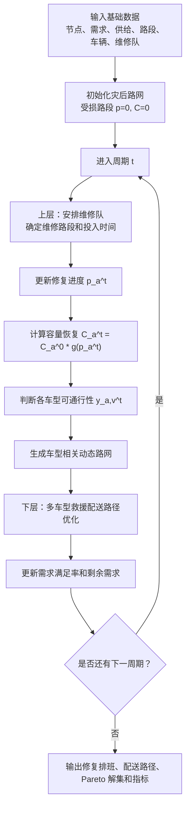

# 拟研究模型文档：道路容量渐进恢复下的修复-配送协同优化

> 本文参考 `docs/algorithm_flow.md` 的结构，描述拟研究模型。模型创新点是：将灾后道路状态从二元可达扩展为容量随修复进度渐进恢复，并考虑不同车辆类型对道路恢复程度的通行要求。

## 1. 模型核心思想

原始模型可以理解为：

```text
道路未修好：不可通行
道路修好：恢复通行
```

拟研究模型改为：

```text
道路未修复：不可通行
道路临时抢通：小型车可低速通行
道路单车道限行：小型车和中型车可通行
道路基本恢复：大部分货车可通行
道路完全修复：所有车辆正常通行
```

因此，修路不再只影响“是否可达”，而是同时影响：

- 路段容量；
- 车辆类型是否可通；
- 车辆实际通行时间；
- 配送路径选择；
- 哪些受灾点可以先得到少量急需物资。

## 2. 模型结构

拟研究模型仍保持“道路修复 + 救援配送”的协同结构，但下层配送使用动态容量路网。

```text
上层：维修队道路修复排班
状态层：根据修复进度更新道路容量和车型可通行性
下层：多车型救援物资配送路径优化
```

与 Li & Teo (2019) 的主要差异：

| 模块 | 原模型口径 | 拟研究口径 |
|---|---|---|
| 道路状态 | 二元可达或修复后可用 | 多阶段容量恢复 |
| 修复效果 | 修复完成后才充分影响配送 | 修复过程中即可部分影响配送 |
| 车辆类型 | 主要体现容量和数量 | 同时体现载重、数量、道路占用和通行阈值 |
| 配送路径 | 基于当期可达路网 | 基于当期容量和车型可通行路网 |
| 算法 | HSSPGA 或普通 GA 思路 | NSGA-II + ALNS 混合多目标算法 |

## 3. 集合与索引

| 符号 | 含义 |
|---|---|
| `N` | 节点集合 |
| `Ns` | 供给节点集合 |
| `Nq` | 需求节点集合 |
| `A` | 路段集合 |
| `Ar` | 受损路段集合 |
| `K` | 维修队集合 |
| `V` | 车辆类型集合 |
| `T` | 周期集合 |

## 4. 主要参数

| 参数 | 含义 |
|---|---|
| `D_i` | 需求点 `i` 的需求量 |
| `S_m` | 供给点 `m` 的供给量 |
| `t_a^0` | 路段 `a` 的正常基础通行时间 |
| `C_a^0` | 路段 `a` 的正常容量 |
| `R_a` | 受损路段 `a` 完全修复所需时间 |
| `eta` | 单个周期长度 |
| `Q_v` | 车辆类型 `v` 的单车容量 |
| `N_v` | 车辆类型 `v` 的数量 |
| `rho_v` | 车辆类型 `v` 的道路占用系数 |
| `theta_v` | 车辆类型 `v` 的最低道路修复进度要求 |
| `g(p)` | 道路容量恢复函数 |
| `M` | 大常数 |

## 5. 决策变量

### 道路修复变量

| 变量 | 含义 |
|---|---|
| `x_a,k^t` | 周期 `t` 中维修队 `k` 是否维修受损路段 `a` |
| `w_a,k^t` | 周期 `t` 中维修队 `k` 投入到路段 `a` 的维修时间 |
| `p_a^t` | 周期 `t` 结束时路段 `a` 的累计修复进度 |
| `z_a^t` | 周期 `t` 结束时路段 `a` 是否完全修复 |

### 路网状态变量

| 变量 | 含义 |
|---|---|
| `C_a^t` | 周期 `t` 中路段 `a` 的当前容量 |
| `y_a,v^t` | 周期 `t` 中车辆类型 `v` 是否可通过路段 `a` |
| `tau_a,v^t` | 周期 `t` 中车辆类型 `v` 通过路段 `a` 的通行时间 |

### 救援配送变量

| 变量 | 含义 |
|---|---|
| `q_m,i,v^t` | 周期 `t` 中用车辆类型 `v` 从供给点 `m` 向需求点 `i` 配送的物资量 |
| `u_i^t` | 周期 `t` 结束时需求点 `i` 的累计满足量 |
| `r_i^t` | 周期 `t` 结束时需求点 `i` 的剩余未满足需求 |
| `h_i^t` | 周期 `t` 中需求点 `i` 的满足率 |
| `route_v^t` | 周期 `t` 中车辆类型 `v` 的配送路径集合 |

## 6. 道路容量渐进恢复

### 6.1 修复进度

受损路段 `a` 的修复进度由累计维修时间决定：

```text
p_a^t = min(1, Σ_{s<=t} Σ_k w_a,k^s / R_a)
```

其中：

- `p_a^t = 0` 表示完全未修复；
- `p_a^t = 1` 表示完全修复；
- `0 < p_a^t < 1` 表示部分恢复。

### 6.2 容量恢复函数

第一版建议使用分段函数：

```text
g(p) =
  0.00, 0 <= p < 0.30
  0.30, 0.30 <= p < 0.60
  0.60, 0.60 <= p < 0.80
  0.80, 0.80 <= p < 1.00
  1.00, p = 1.00
```

当前容量：

```text
C_a^t = C_a^0 * g(p_a^t)
```

对于未受损道路：

```text
p_a^t = 1
C_a^t = C_a^0
```

### 6.3 车型可通行约束

车辆类型 `v` 能否通过路段 `a` 取决于道路修复进度：

```text
y_a,v^t = 1, if p_a^t >= theta_v
y_a,v^t = 0, if p_a^t < theta_v
```

例如：

| 车辆类型 | 最低通行进度 |
|---:|---:|
| 小型车 | 0.30 |
| 中型车 | 0.50 |
| 大型车 | 0.70 |
| 重型车 | 0.80 |

这使得同一条路在不同修复阶段可服务不同车型。

### 6.4 通行时间计算

第一版可以使用容量折减近似：

```text
tau_a,v^t = t_a^0 / g(p_a^t), if y_a,v^t = 1
tau_a,v^t = INF, if y_a,v^t = 0
```

后续可升级为 BPR 函数：

```text
tau_a,v^t = t_a^0 * [1 + alpha * (f_a,v^t / C_a^t)^beta]
```

其中 `f_a,v^t` 可由车辆类型道路占用系数 `rho_v` 近似计算。

## 7. 目标函数

拟研究建议采用多目标形式，与 NSGA-II + ALNS 算法匹配。

### 目标 1：最小化累计未满足需求

```text
min F1 = Σ_t Σ_i r_i^t
```

该目标体现救援效果。

### 目标 2：最小化配送与抢修总时间

```text
min F2 = Σ_t 配送车辆通行时间 + Σ_t 维修队作业与移动时间
```

该目标体现救援效率。

### 目标 3：最大化公平性

可以用最小满足率表示：

```text
max F3 = min_i (u_i^T / D_i)
```

也可以转化为最小化满足率差异：

```text
min F3' = max_i h_i^T - min_i h_i^T
```

第一版建议使用 `min_i (u_i^T / D_i)`，便于与 Li & Teo 的最大相对满意度思想衔接。

## 8. 主要约束

### 8.1 维修队时间约束

每支维修队每个周期可投入的维修时间不超过周期长度：

```text
Σ_a w_a,k^t <= eta
```

### 8.2 修复进度约束

修复进度不能超过 1：

```text
0 <= p_a^t <= 1
```

并且随周期非递减：

```text
p_a^t >= p_a^(t-1)
```

### 8.3 供给约束

每个供给点累计发出物资不能超过其供给量：

```text
Σ_t Σ_i Σ_v q_m,i,v^t <= S_m
```

### 8.4 需求约束

每个需求点累计获得物资不能超过需求量：

```text
u_i^t <= D_i
```

剩余需求：

```text
r_i^t = D_i - u_i^t
```

### 8.5 车辆容量约束

车辆运输量不能超过车辆容量和数量：

```text
Σ_i q_m,i,v^t <= Q_v * N_v
```

### 8.6 路径可通行约束

如果路径包含路段 `a`，则该车辆类型必须满足：

```text
y_a,v^t = 1
```

否则该路径不可用。

### 8.7 动态路网更新约束

每个周期结束后，根据维修队投入时间更新：

```text
repair plan -> p_a^t -> C_a^t -> y_a,v^t -> tau_a,v^t -> routes
```

这条更新链是本模型区别于二元道路模型的核心。

## 9. 周期运行逻辑



## 10. 一个示例

假设路段 `a` 完全修复时间为 900 分钟，正常容量为 1000 pcu/h，周期长度为 480 分钟。

第 1 期维修后：

```text
p_a^1 = 480 / 900 = 0.533
g(p_a^1) = 0.30
C_a^1 = 300 pcu/h
```

此时：

```text
小型车 theta=0.30，可通行
中型车 theta=0.50，可通行
大型车 theta=0.70，不可通行
重型车 theta=0.80，不可通行
```

第 2 期维修完成后：

```text
p_a^2 = 1.000
g(p_a^2) = 1.00
C_a^2 = 1000 pcu/h
所有车辆可通行
```

这个例子说明：道路在完全修复前已经能对救援配送产生作用。

## 11. 与原模型的对比实验

建议设置以下实验组：

| 实验组 | 道路状态 | 车辆类型约束 | 用途 |
|---|---|---|---|
| Baseline | 二元可达 | 只考虑容量和数量 | 对照 Li & Teo 思路 |
| Model A | 容量渐进恢复 | 不区分车型通行阈值 | 验证容量恢复本身的价值 |
| Model B | 容量渐进恢复 | 区分车型通行阈值 | 验证完整创新模型 |
| Model C | 容量渐进恢复 | 区分车型，并加入 ALNS 强化 | 验证算法改进效果 |

评价指标：

- 累计未满足需求；
- 最小需求满足率；
- 总配送时间；
- 道路恢复完成时间；
- 车辆利用率；
- Pareto 解集质量；
- 算法运行时间。

## 12. 推荐论文表述

模型创新可以写成：

> 将灾后道路状态由传统二元可达变量扩展为基于修复进度的容量渐进恢复变量，刻画道路从完全中断、临时抢通、限行通行到完全恢复的动态过程；进一步引入异质救援车辆的最低通行阈值，使配送路径选择同时受道路恢复进度、当前容量和车辆类型约束影响。

这个表述比单纯“考虑道路受损”更明确，也能和已有道路可靠性、道路损毁率、鲁棒 LRP 文献区分开。
